# Task1.1
    
## 1. Installed GIT on my workstation.

> 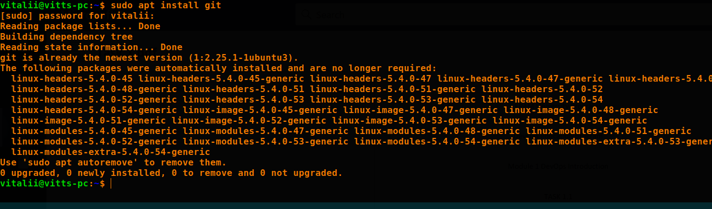

## 2. Changed my global configs (added name and email, setuped core text editor).

> 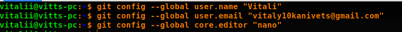

## 3. Created account on GitHub.

> 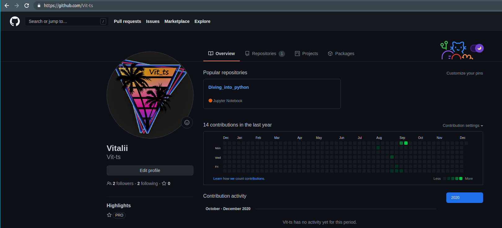

## 4. Created new private repo on GitHub. Repo name: DevOps_online_Kharkiv_2020Q42021Q15.

> 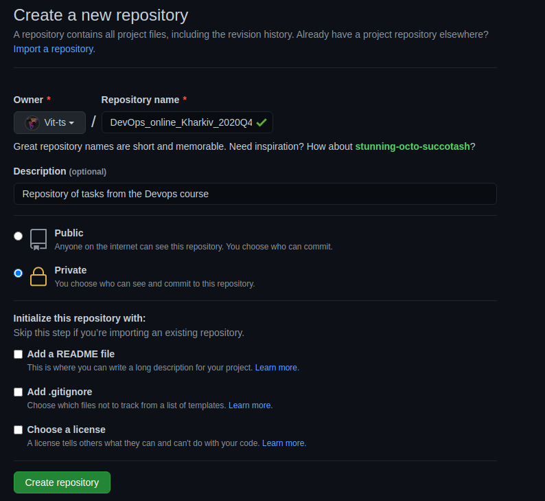

5. ## Repository structure

> 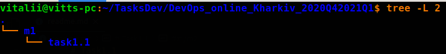

## 6. Cloned repo to my workstation.
## 7. Opened git console in root directory of my project and make next steps.
## 8. Did all my experiments in folder “task1.1”.

> 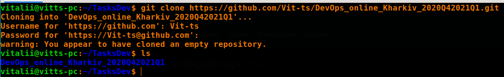

## 9. Created empty [readme.txt](readme.txt) file.
## 10. Made init commit.
## 11. Created develop branch and checkout on it.

> 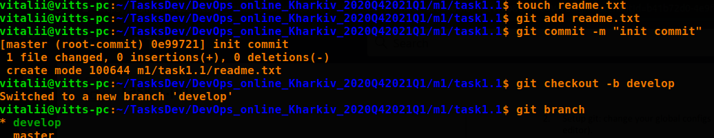

## 12. Created [index.html](index.html) empty file. Commited.

> 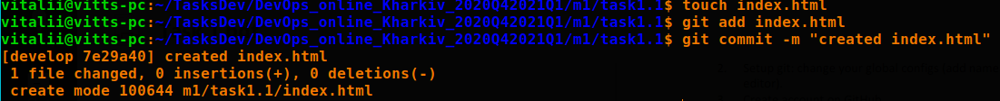

## 13. Created branch with name “images”. Checkouted on it. Added images folder with some [image](images/devops.png) inside it. Committed.

> 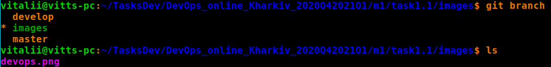

> 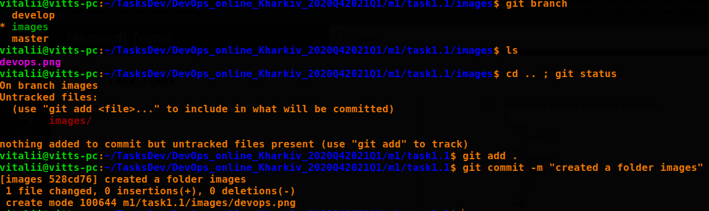

## 14. Changed my [index.html](index.html). Added an [image](images/devops.png) source inside it. Committed.

> 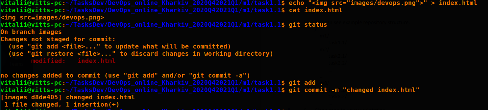

## 15. Went back to develop branch.

> 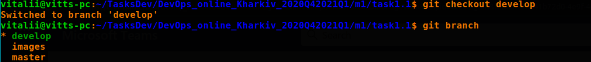

## 16. Create branch with name“styles”.Checkouton it.Add styles folder with styles source insideit. Committed.

> 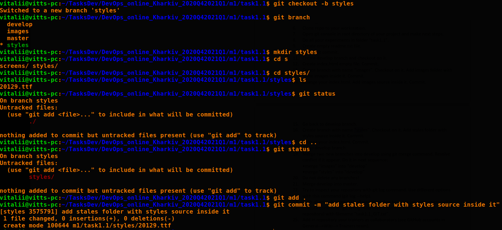

## 17. Changed my [index.html](index.html). Committed.

> 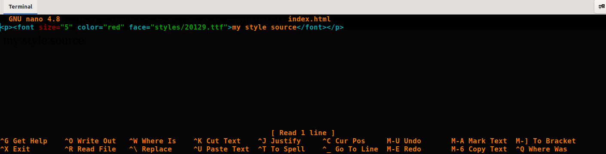

## 18. Went to develop branch.
## 19. Merge two new branches into develop using git merge command. Dit it in next sequence:•

- ## merged “images” into “develop”•

> 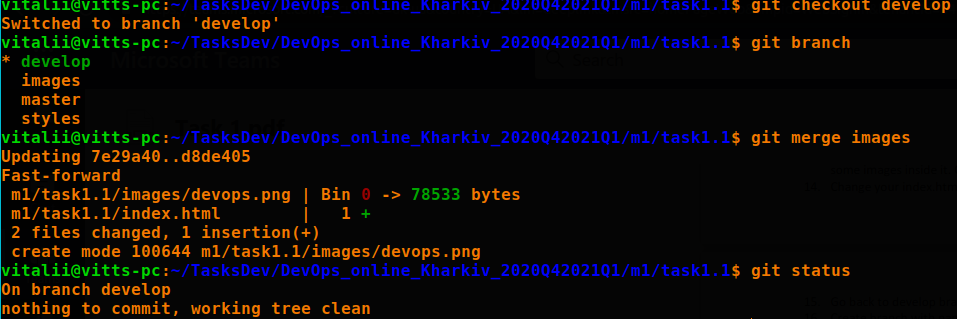

- ## merged “styles” into “develop”

> 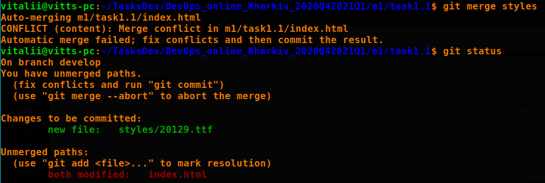

- ## Resolved conflict

> 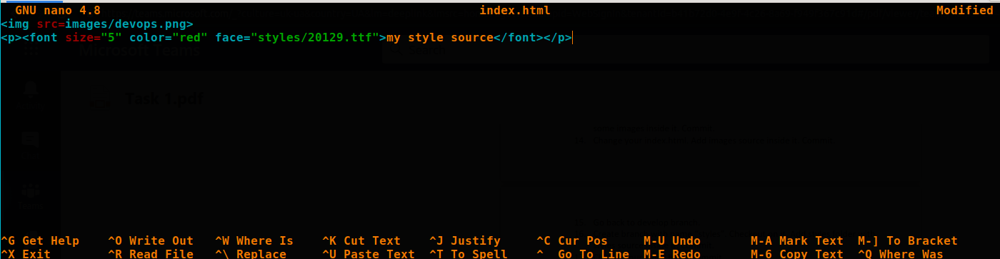

## 20. Do not delete any branches!

> 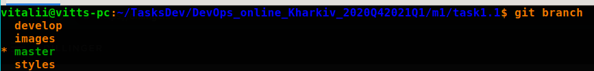

## 21. Merged develop into master.

> 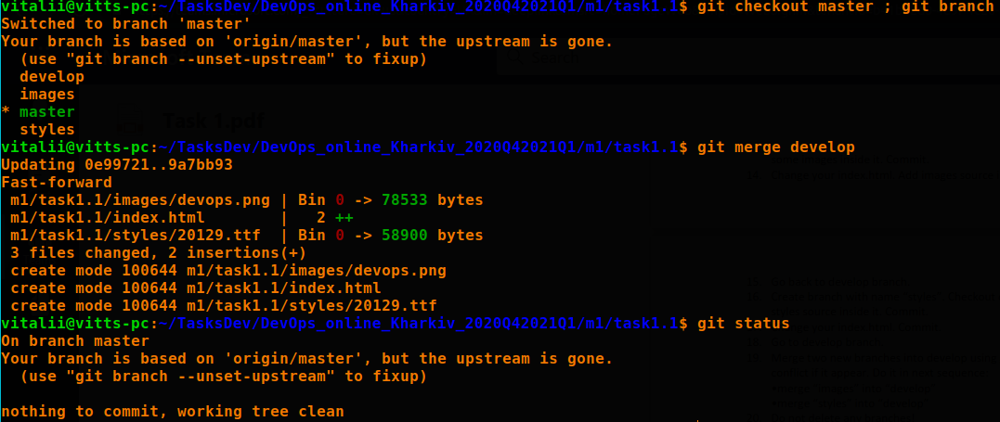

## 22. Inspected my repository with git log command. Use different options with this command (git log --help).

## 22.1. git log
    
> 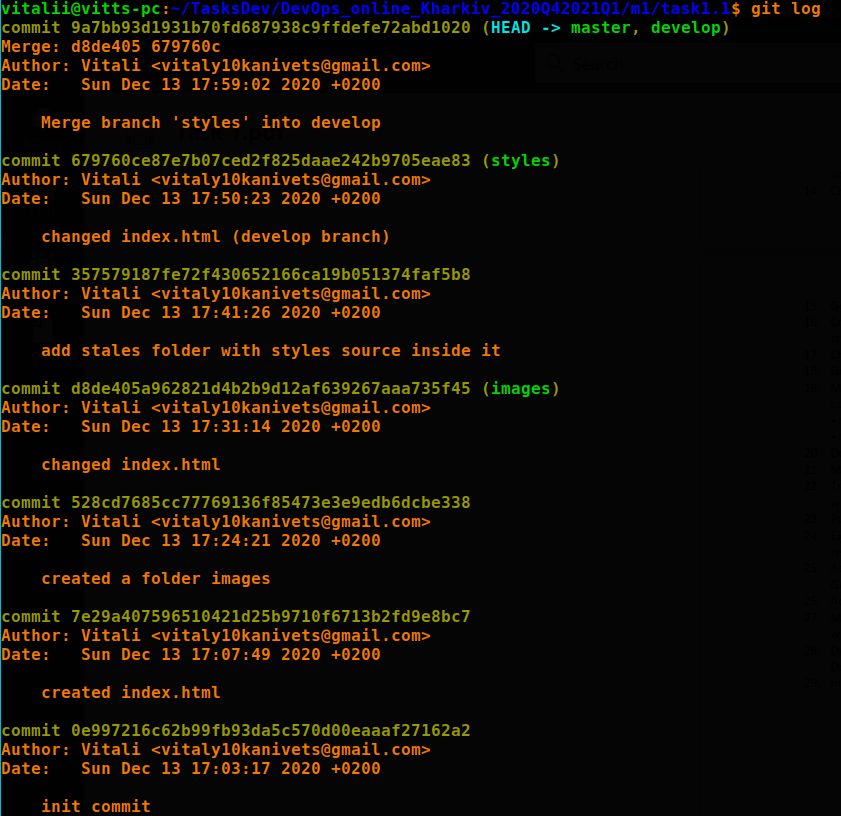

## 22.2. git log --pretty=oneline
    
> 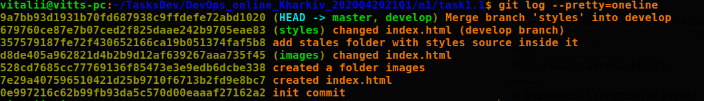

## 22.3. git log --log-sie ---pretty=format:"%h - %s"
    
> 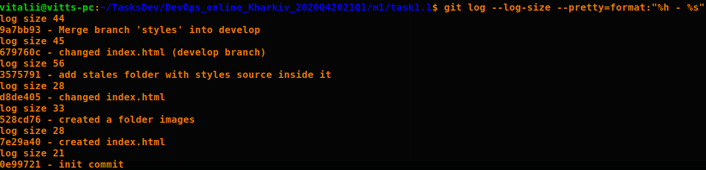

## 23. Pushed all my changes with allyour branches toorigin(git push origin --all).

> 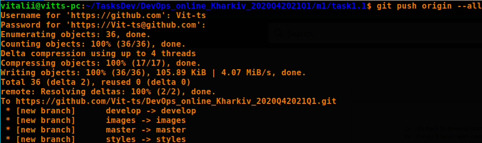

## 24. Executed command “git reflog“ and save it content somewhere (not in repository) with filename “task1.1_GIT.txt”.

> 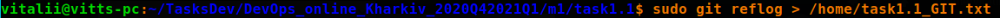

## 25. Added in repository my trainers as collaborators.

> 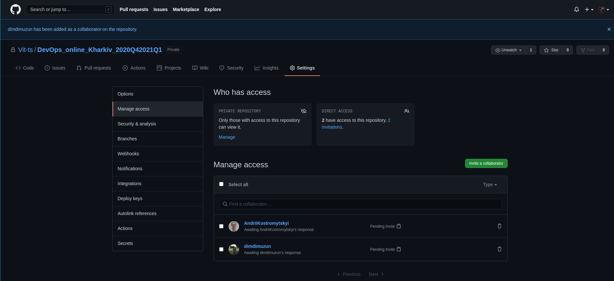

## 26. Added [task1.1_GIT.txt](DevOps_online_Kharkiv_2020Q42021Q1/m1/task1.1_GIT.txt) to my local repo in then Pushed it in GitHub repo.

> 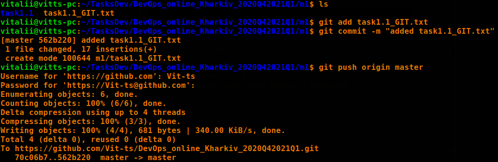

## 27. Made file [readme.md](readme.md) in folder task1.1and described results of my work with Git.

> 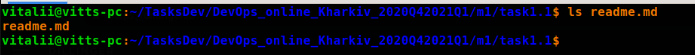

## 28. Described in my own words what DevOps is. Try to use not more 50 words.
## 29. Inserted my text about DevOps in readme.md.

* ## By Devops, I mean the methodology followed not only by the Devops engineer, but by the entire team. This means joint high-quality work on a project.
* ## As for the DevOps developer, he must set up and maintain automatic delivery of code using various DevOps tools.
