## Task2.1

## PART 1. HYPERVISORS.
## 1. What are the most popular hypervisors for infrastructure virtualization? 
## 2. Briefly describe the main differences of the most popular hypervisors.
## PART 2. WORK WITH VIRTUALBOX
## 1. First run VirtualBox and Virtual Machine (VM).
## 1.1 From the official VirtualBox site download the latest stable version of VirtualBox according to the host operating system (OS) installed on the student's workplace. For Windows, the file may be called, for example, VirtualBox-6.1.10-138449-Win.exe. Install VirtualBox.

> 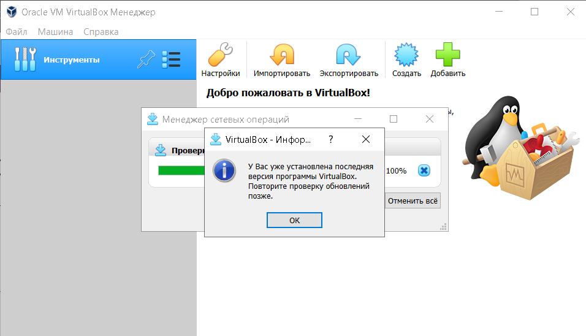

## 1.2 Download the latest stable version of Ubuntu Desktop or Ubuntu Server from the official site.

> 

## 1.3 Create VM1 and install Ubuntu using the instructions. Set machine name "kanivets"

> 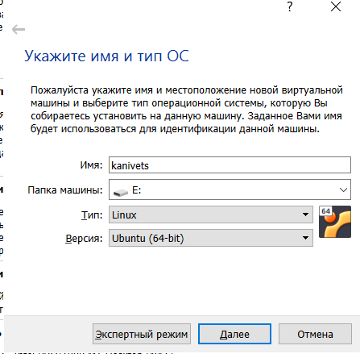
> 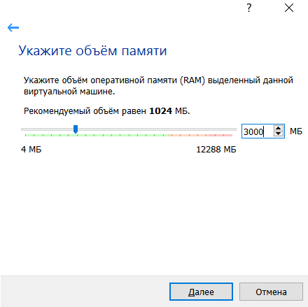
> 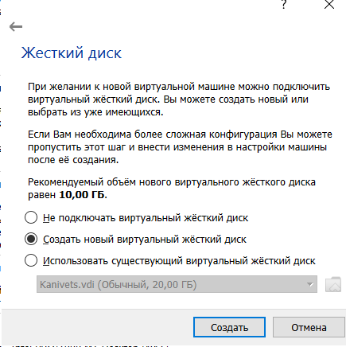
> 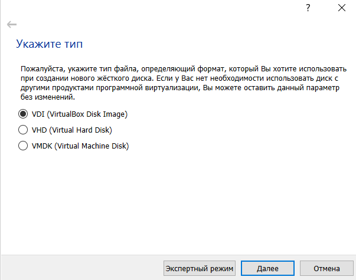
> 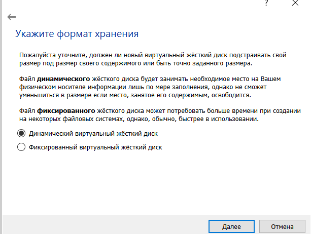
> 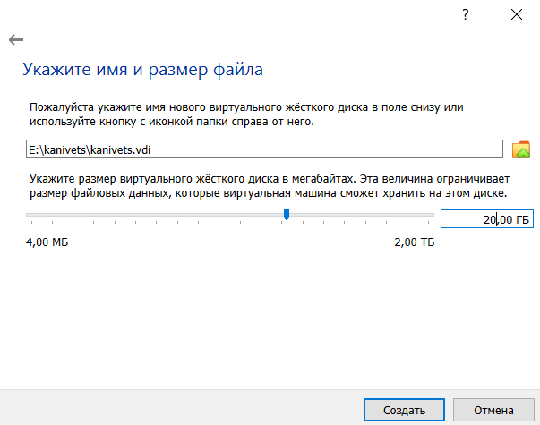
> 
> 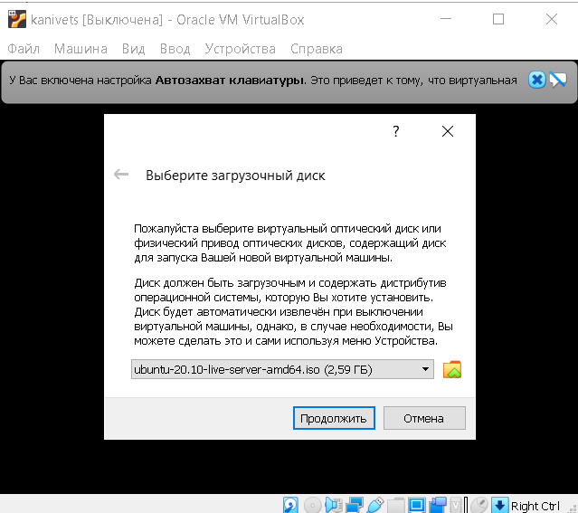
> 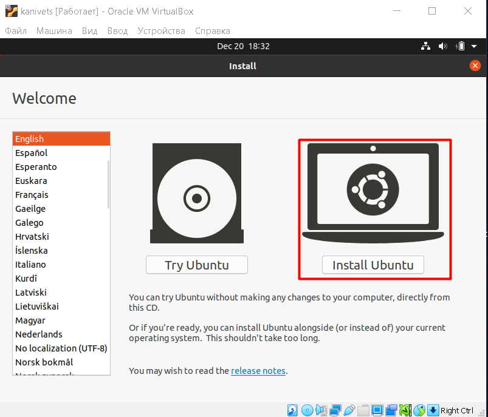
> 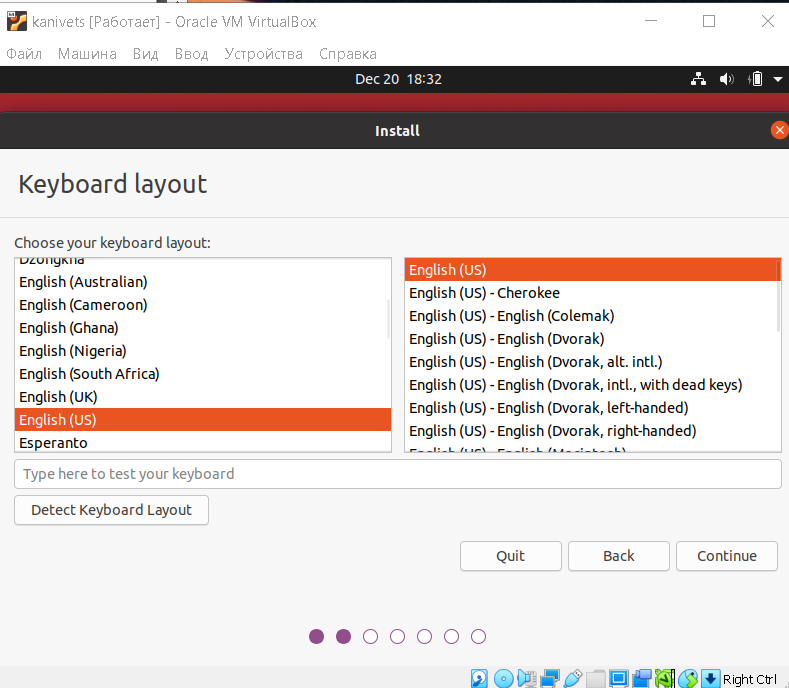
> 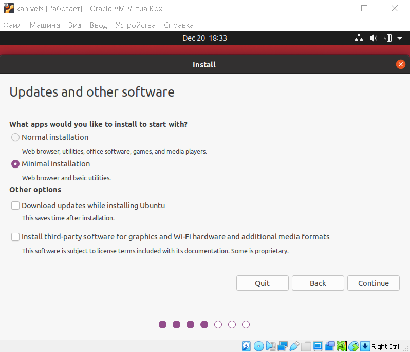
> 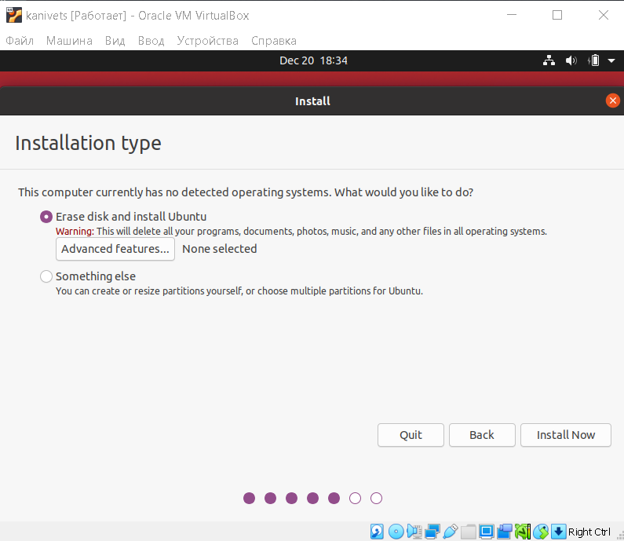
> 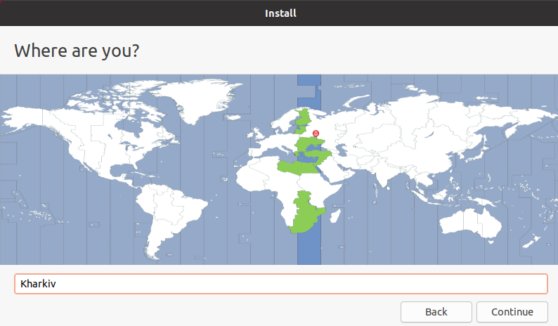
> 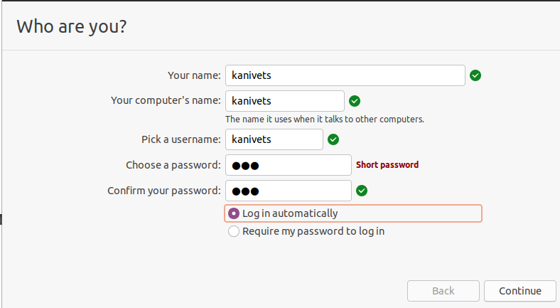
> 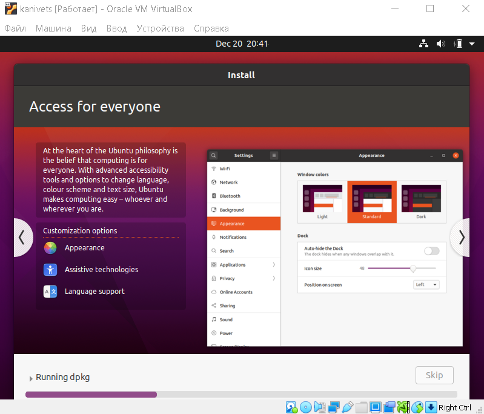

## 1.4 Get acquainted with the possibilities of VM1 control -start, stop, reboot, save state, use Host key and keyboard shortcuts, mouse capture, etc.

> 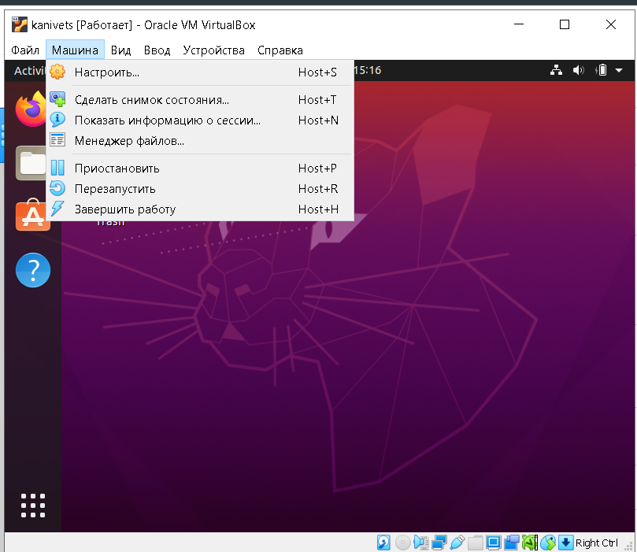
> 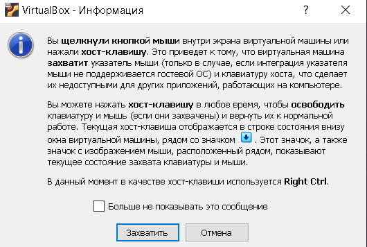
> 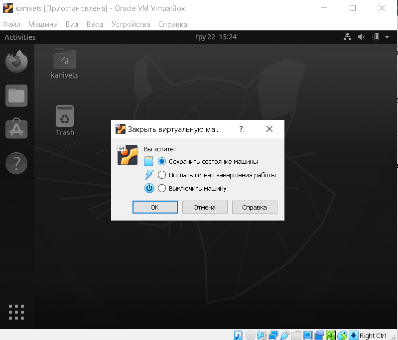
> 
> 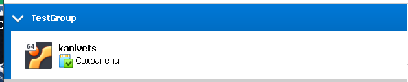

⋅⋅⋅ Создайте группу с помощью VirtualBox Manager. Выполните следующие действия: 
⋅⋅⋅ Создайте группу и назначьте виртуальную машину. Например:

> VBoxManage modifyvm "kanivets" --groups "/ TestGroup" 

⋅⋅⋅ Эта команда создает группу «TestGroup» и присоединяет виртуальную машину «kanivets» к этой группе.
> 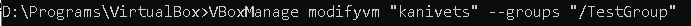
> 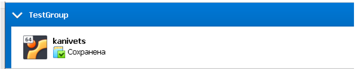

⋅⋅⋅ Отсоедините виртуальную машину от группы и удалите группу, если она пуста. Например:

> VBoxManage modifyvm "kanivets" --groups ""

⋅⋅⋅ Эта команда отключает все группы от виртуальной машины "kanivets" и удаляет пустую группу.

> 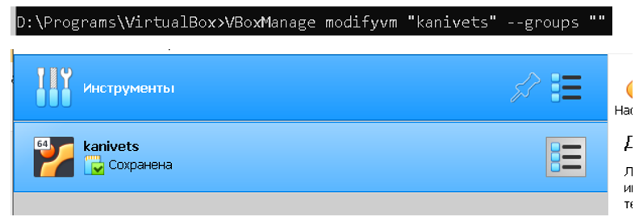

⋅⋅⋅ Создайте несколько групп. Например:

> VBoxManage modifyvm "kanivets" --groups "/ TestGroup, / TestGroup2"

⋅⋅⋅ Эта команда создает группы «TestGroup» и «TestGroup2», если они не существуют, и присоединяет виртуальную машину «kanivets» к ним обеим.
⋅⋅⋅ Создавайте вложенные группы, имея групповую иерархию. Например:

> VBoxManage modifyvm "kanivets" --groups "/ TestGroup / TestGroup2"

⋅⋅⋅ Эта команда присоединяет виртуальную машину «kanivets» к подгруппе «TestGroup2» группы «TestGroup».

> 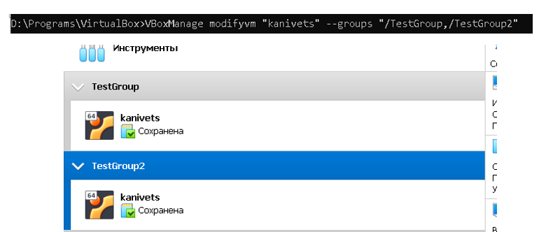

## 1.5 Clone an existing VM1 by creating a VM2.

> 
> 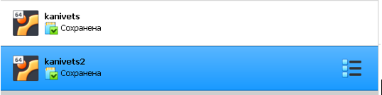

## 1.6 Create a group of two VM: VM1, VM2 and learn the functions related to groups.

> 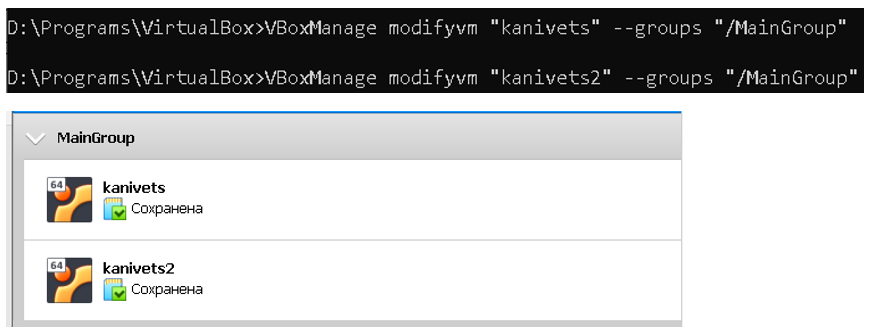

⋅⋅⋅ Renamed VM

> 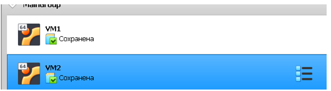

Группы VM позволяют пользователю создавать специальные группы виртуальных машин, для коллективного управления ими. Можно создавать вложенные группы. Групповые операции позволяют делать обычные для виртуальных машин действия сразу для всех членов группы.

## 1.7 For VM1, changing its state, take several different snapshots, forming a branched tree of snapshots.
Существует три операции, связанные со снимками:
⋅⋅⋅ 1)	Вы можете сделать снимок. Это делает копию текущего состояния машины, к которой вы можете позже вернуться в любой момент. 
⋅⋅⋅ Если ваша виртуальная машина в данный момент запущена.

> 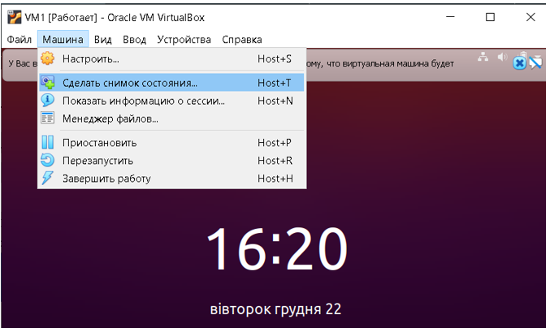

⋅⋅⋅ Если ваша виртуальная машина в настоящее время находится в состоянии «сохранено» или «выключена» 

> 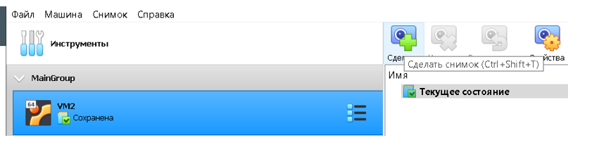

⋅⋅⋅ 2)	Вы можете восстановить снимок, щелкнув правой кнопкой мыши на любом снимке, который вы сделали в списке снимков. Восстановив моментальный снимок, вы будто возвращаетесь в момент его создания: текущее состояние машины теряется, и машина возвращается в точное состояние, в котором машина была, когда делался снимок.

> 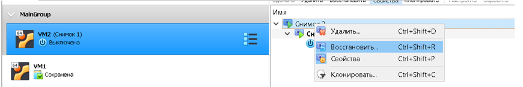

⋅⋅⋅ В результате получаем древовидную систему снимков

> 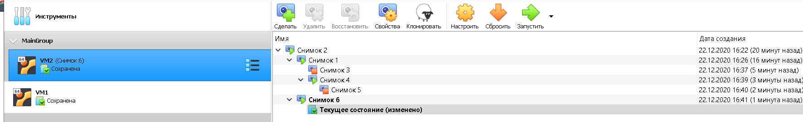

⋅⋅⋅ 3)	Вы также можете удалить снимок, который не повлияет на состояние виртуальной машины, но только отпустите файлы на диске, которые VirtualBox использовал для хранения данных моментальных снимков, тем самым освободив место на диске. Чтобы удалить снимок, щелкните его правой кнопкой мыши в дереве снимков и выберите «Удалить». Начиная с VirtualBox 3.2, снимки могут быть удалены даже во время работы машины.

> 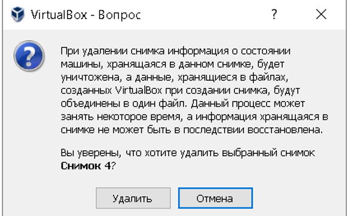

## 1.8 Export VM1. Save the *.ova file to disk. Import VM from *.ova file.
⋅⋅⋅ OVF – это межплатформенный стандарт, поддерживаемый многими продуктами виртуализации, который позволяет создавать готовые виртуальные машины, которые затем могут быть импортированы в виртуализатор, такой как VirtualBox.
⋅⋅⋅Устройства в формате OVF могут отображаться в двух вариантах:
- Они могут поставляться в нескольких файлах в виде одного или нескольких образов дисков, обычно в широко используемом формате VMDK и текстовом файле с описания на языке XML с расширением .ovf. Чтобы иметь возможность их импорта, файлы должны находиться в одном каталоге.
- В качестве альтернативы, вышеупомянутые файлы могут быть упакованы вместе в один файл архива, как правило, с расширением .ova.
⋅⋅⋅ Чтобы импортировать устройство в один из вышеуказанных форматов, просто дважды щелкните файл OVF/OVA. Или выберите «Файл» → «Импорт конфигураций» в окне Менеджера. В появившемся диалоговом окне файла перейдите к файлу с расширением  .ova.
- export
> 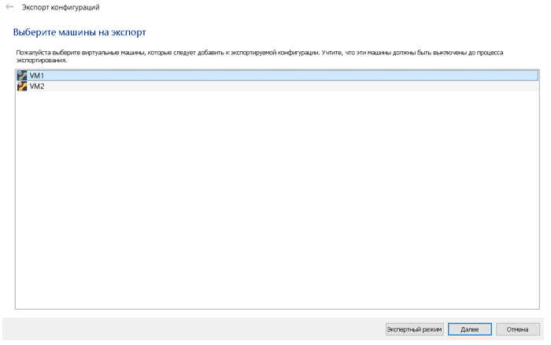
> 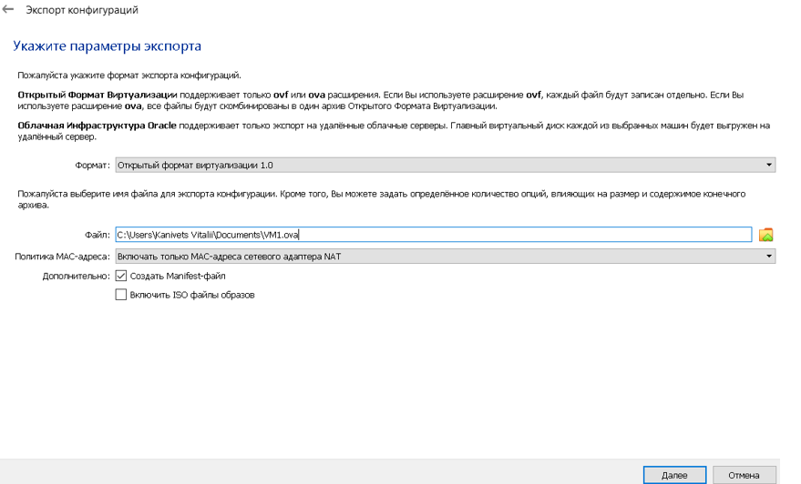
> 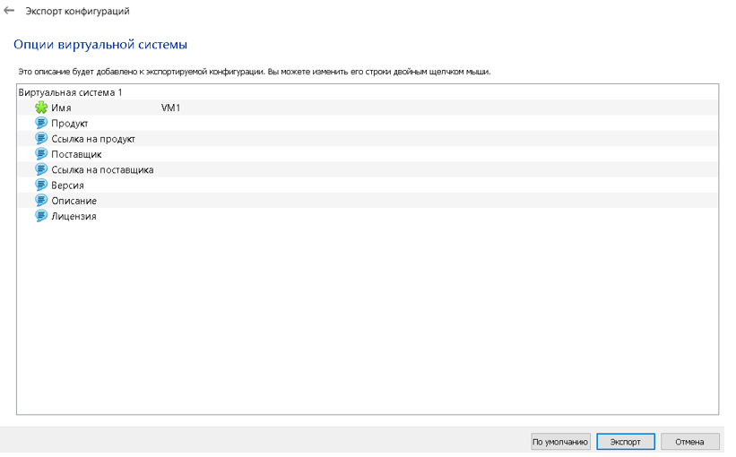

- import 

> 
> 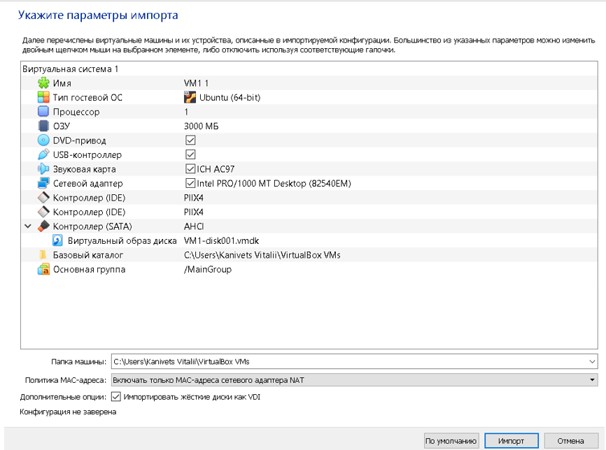
> 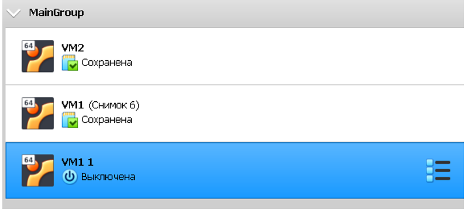

## 2. Configuration of virtual machines
## 2.1 Explore VM configuration options (general settings, system settings, display, storage, audio, network, etc.).
## 2.2 Configure the USB to connect the USB ports of the host machine to the VM.
Данная настройка USB позволить подключить любое USB кстройство

> 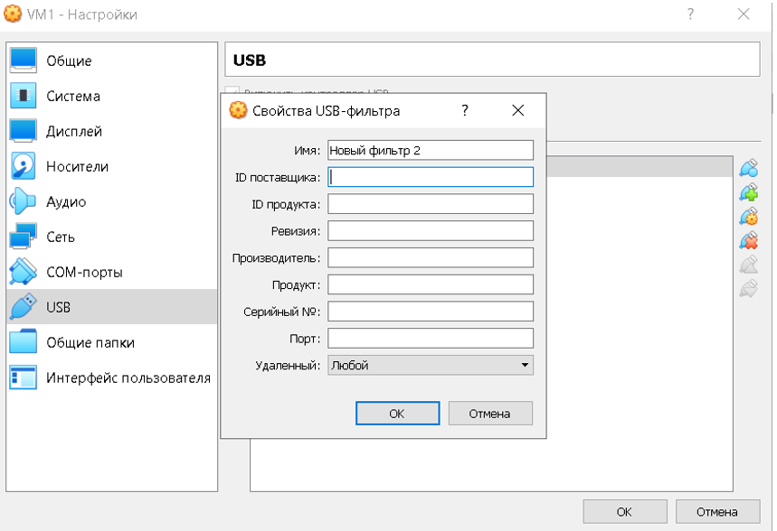
> 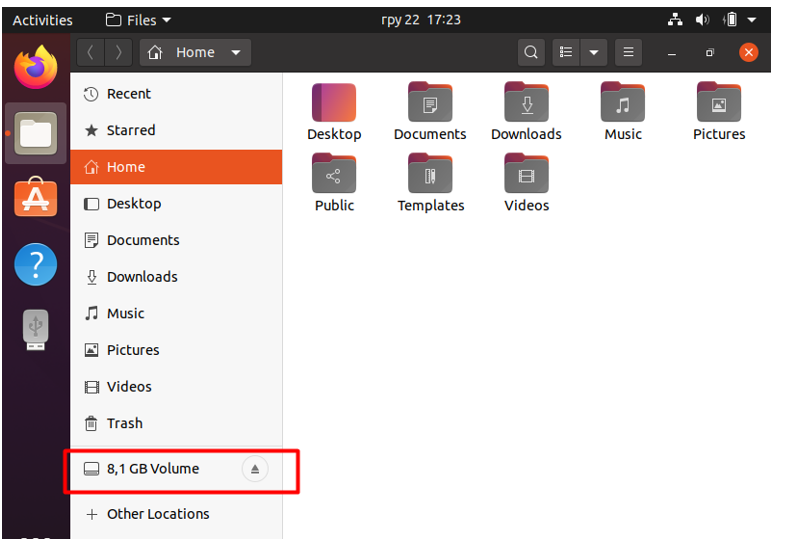

## 2.3 Configure a shared folder to exchange data between the virtual machine and the host.

> 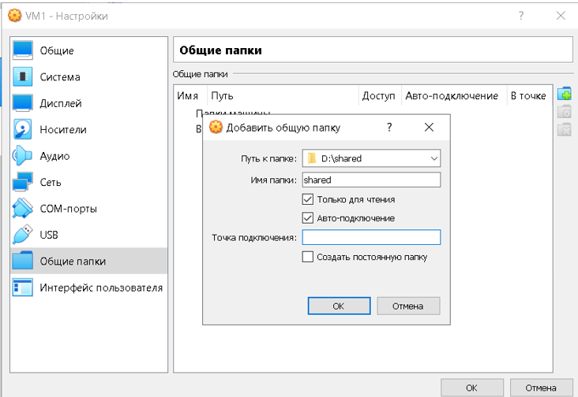
> 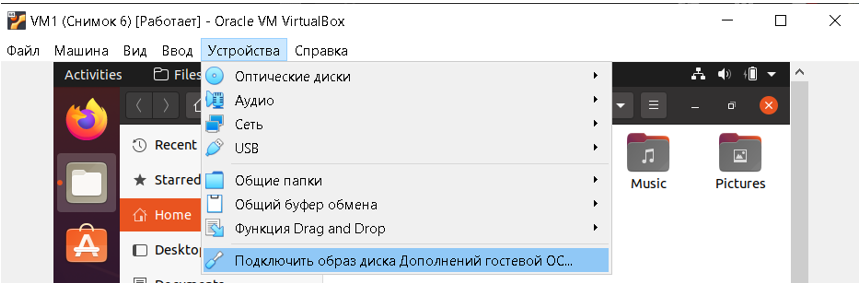
> 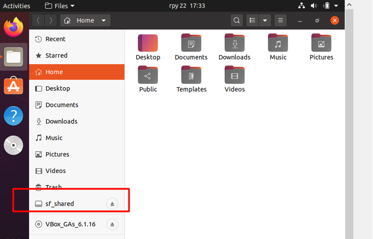

## 2.4 Configure different network modes for VM1, VM2. Check the connection between VM1, VM2, Host, Internet for different network modes. You can use the ping command to do this. Make a table of possible connections.
- Internal

> 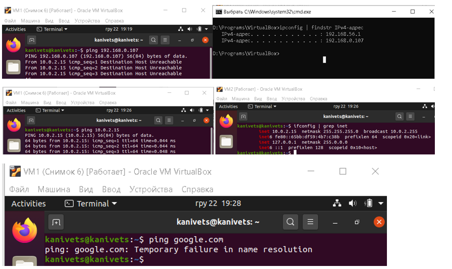

- Bridged

> 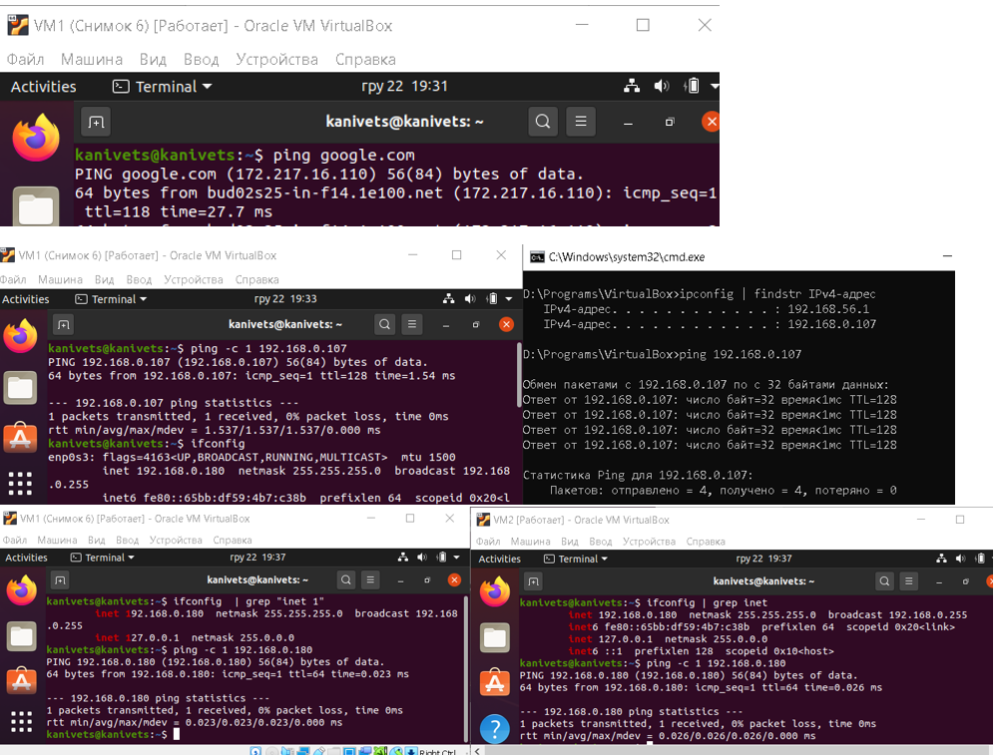

- NAT

> 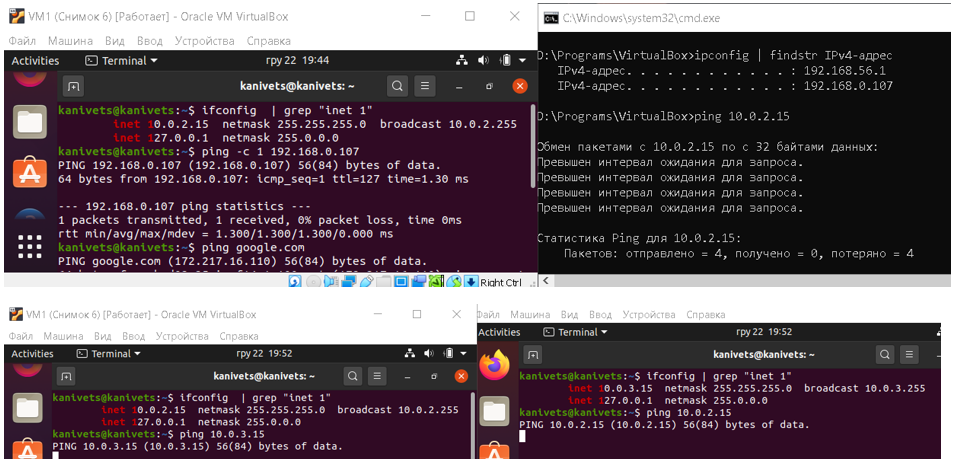

- NATservice (аналогично как и NAT кроме VM1<>VM2)

> 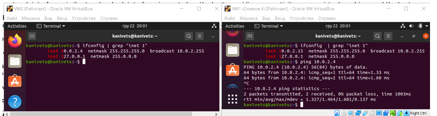

- Host–only

> 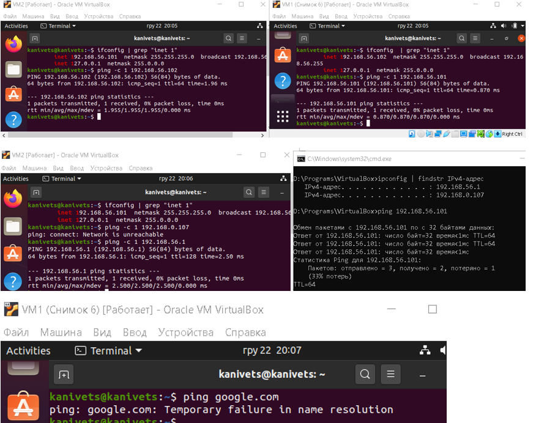

Table 

| Mode         | VM > Host | VM < Host | VM1 <> VM2 | VM > Net/LAN | VM < Net/LAN |
| -------------|:---------:| ---------:| ----------:| ------------:| ------------:|
| Internal     |	  -	   |      -    |	 +   	|      -	   |       -      |
| Bridged      |	  +	   |      +    |	 +   	|      +	   |       +      |
| NAT	       |	  +	   | P. forward|	 -   	|      +	   | P. forward   |
| NATservice   |	  +	   | P. forward|	 +   	|      +	   | P. forward   |
| Host-only	   |	  +	   |      +    |	 +   	|      -	   |       -      |

## 3. Work with CLI through VBoxManage.
## 3.1 Run the cmd.exe command line.
## 3.2 Examine the purpose and execute the basic commands of VBoxManage list, showvminfo, createvm, startvm, modifyvm, clonevm, snapshot, controlvm [1, ch.8]. 
- Showvminfo - The showvminfo command shows information about a particular virtual machine. В примере ниже приведеда часть информации о VM1

> 

- createvm - The VBoxManage createvm command creates a new XML virtual machine definition file. startvm - This command starts a virtual machine that is currently in the Powered Off or Saved states. В примере создаем новую XML VM3 с типом Ubunty_64 и регистрируем виртуальную машину.

> 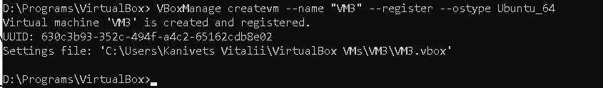

- modifyvm - This command changes the properties of a registered virtual machine which is not running. Most of the properties that this command makes available correspond to the VM settings that Oracle VM VirtualBox graphical user interface displays in each VM's Settings dialog.
В примере ниже для машины VM1 меняем количество ядер, оперативную память, откючаем аудио и usb. 

> 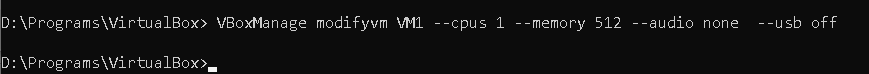

- Startvm - This command starts a virtual machine that is currently in the Powered Off or Saved states. В примере ниже запускаем VM2 в режиме с GUI.

> 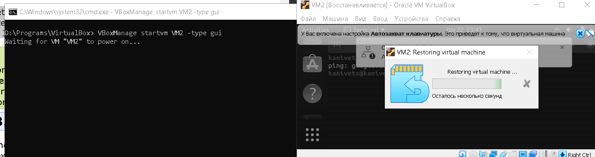

- clonevm - Create a clone of an existing Oracle VM VirtualBox virtual machine.
snapshot - Manage Oracle VM VirtualBox virtual machine snapshots.
В примере ниже создаем полную копию(clone) VM1.

> 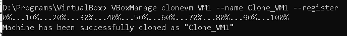

- controlvm - The controlvm subcommand enables you to change the state of a virtual machine that is currently running.
В примерере ниже ставим на паузу, возобновляем и выключаем VM2.

> 

## PART 3. WORK WITH VAGRANT

## 1. Установил Vagrant на ПК.

> 

## 2. Run the powershell. Create a folder "Vitalii". Next, go to the folder.

> 

## 3. Initialize the environment with the default Vagrant box: init hashicorp/precise64

> 

## 4. Run vagrant up and watch for messages during VM boot and startup.

> 

## 5. Connect to the VM using the program MobaXterm, using SSH, IP address and port listed above (127.0.0.1:2222). By default, login - vagrant and password are also vagrant

> 
> 

## 6. Record the date and time by executing the date command

> 

## 7. Stop and delete the created VM.

> 

## 8. Create your own Vagrant box

1) created directory VagrantBox

> 

2) Делаем vagrant init ubuntu/trusty64 и запускаю VM

> 
> 

И мы можем убедится, что VM запустилась посмотрев в VirtualBox.

> 

А также проверяем через MobaXterm

> 

3) Проверяем команды status, suspend, halt

> 
> 
> 
