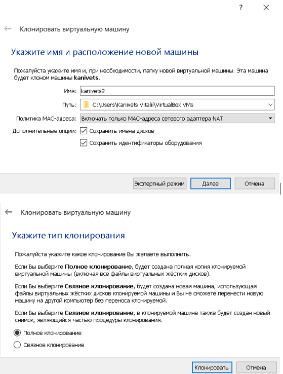
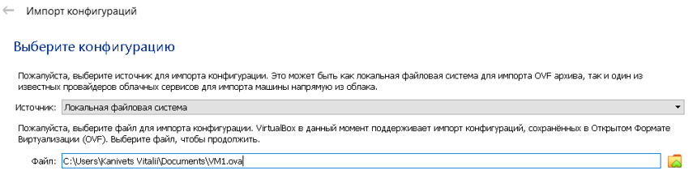
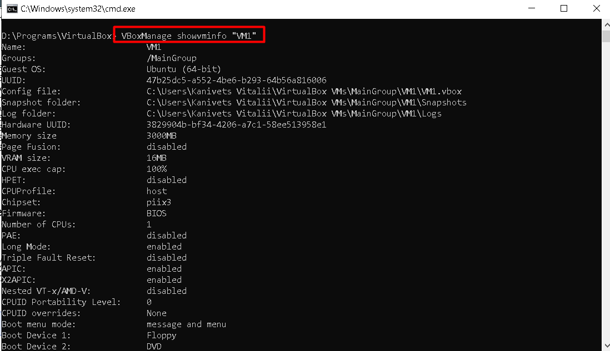
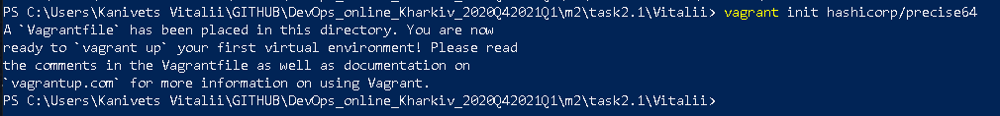

## Task2.1

## PART 1. HYPERVISORS.
## 1. The most popular hypervisors for infrastructure virtualization.
Currently the most popular hypervisors are: 
- VMware;
- Hyper-V;
- KVM; 
- XenServer.

## 2. Briefly described the main differences of the most popular hypervisors.
### VMware Features:
- VM File System: Clustered file system for VM;
- Virtual SMP: Allows one virtual machine to use multiple physical processors at the same time;
- vCenter Server: A centralized management tool used to configure, provision and manage virtualized IT environments;
- fault tolerance;
- High availability.
### Hyper Features:
- Support for persistent memory;
- Shielded VM updates;
- Simple two-node clusters;
- ReFS deduplication;
- Optimizing Storage Spaces Direct;
- Windows Admin Center;
- Encrypted subnets.
### KVM Features: 
- Container support;
- Scalability;
- Overcommit resources;
- Disk I/O throttling;
- Hot swapping of virtual resources;
- Inexpensive virtualization solution;
- Live migration and storage migration;
- Assigning any PCI devices to virtual machines.
### XenServer Features:
- Site recovery;
- Host crash protection;
- Multi-server management;
- Dynamic memory management;
- Active Directory Integration;
- Role-Based Administration and Control;
- Mixed resource pools with CPU masking;
- Distributed Virtual Switch Controller;
- In-memory read caching;
- Live VM migration and XenMotion storage.

## PART 2. WORK WITH VIRTUALBOX
## 1. First run VirtualBox and Virtual Machine (VM).
## 1.1 From the official VirtualBox site downloaded the latest stable version of VirtualBox and installed.

> 

## 1.2 Downloaded the latest stable version of Ubuntu Desktop from the official site.

> 

## 1.3 Created VM1 and installed Ubuntu. Set machine name "kanivets"

> 

> 

> 

> 

> 

> 

> 

> 

> 

> 

> 

> 

> 

> 

> 

## 1.4 Got acquainted with the possibilities of VM1 control -start, stop, reboot, save state, use Host key and keyboard shortcuts, etc.

> 

> 

> 

> 

> 

## Created a group and assigned a virtual machine:

> VBoxManage modifyvm "kanivets" --groups "/ TestGroup" 

## This command creates a "TestGroup" and joins the "kanivets" virtual machine to this group.

> 

> 

## Detached the virtual machine from the group and deleted the group if it is empty:

> VBoxManage modifyvm "kanivets" --groups ""

## This command disconnects all groups from the "kanivets" virtual machine and deletes the empty group.

> 

## Created several groups:

> VBoxManage modifyvm "kanivets" --groups "/ TestGroup, / TestGroup2"

## This command creates the groups "TestGroup" and "TestGroup2" if they do not exist and attaches the virtual machine "kanivets" to both of them.
## Created nested groups having a group hierarchy:

> VBoxManage modifyvm "kanivets" --groups "/ TestGroup / TestGroup2"

## This command attaches the kanivets virtual machine to the TestGroup2 subgroup of the TestGroup.

> 

## 1.5 Cloned an existing VM1 by creating a VM2.

> 

> 

## 1.6 Created a group of two VM: VM1, VM2 and learn the functions related to groups.

> 

## Renamed virtual machines

> 

VM groups allow the user to create special groups of virtual machines for collective management of them. You can create nested groups. Group operations allow you to perform actions common for virtual machines for all group members at once.

## 1.7 For VM1, changing its state, take several different snapshots, forming a branched tree of snapshots.

There are three operations associated with snapshots:
1) You can take a picture. This makes a copy of the current state of the machine, which you can return to at any time later.
If your virtual machine is currently running.

> 

If your virtual machine is currently in a "saved" or "shutdown" state

> 

2) You can restore a snapshot by right clicking on any snapshot you have taken in the snapshot list. When you restore a snapshot, you are like returning to the moment it was taken: the current state of the machine is lost, and the machine returns to the exact state that the machine was in when the snapshot was taken.

> 

As a result, we get a tree-like system of images

> 

3) You can also delete the snapshot, which will not affect the state of the virtual machine, but just release the files on disk that VirtualBox used to store the snapshot data, thereby freeing up disk space. To delete a snapshot, right-click it in the snapshot tree and select Delete. Starting with VirtualBox 3.2, snapshots can be deleted even while the machine is running.

> 

## 1.8 Exported VM1. Save the *.ova file to disk. Imported VM from *.ova file.

OVF is a cross-platform standard that allows you to create off-the-shelf virtual machines that can then be imported into a virtualizer like VirtualBox.
Devices in OVF format can be displayed in two versions:
1) They can be supplied in multiple files as one or more disk images, usually in the widely used VMDK format and an XML description text file with the .ovf extension. To be able to import them, the files must be in the same directory.
2) Alternatively, the above files can be packed together into one archive file, usually with the .ova extension.
To import a device in one of the above formats, just double-click the OVF / OVA file. Or select "File" → "Import Configurations" in the Manager window. In the file dialog that appears, navigate to the .ova file.

- export

> 

> 

> 

- import 

> 

> 

> 

## 2. Configuration of virtual machines
## 2.1 Explored VM configuration options (general settings, system settings, display, storage, audio, network, etc.).
## 2.2 Configure the USB to connect the USB ports of the host machine to the VM.

This USB setting allows you to connect any USB device.

> 

> 

## 2.3 Configured a shared folder to exchange data between the virtual machine and the host.

> 

> 

> 

## 2.4 Configured different network modes for VM1, VM2. Checked the connection between VM1, VM2, Host, Internet for different network modes. Used the ping command to do this. Made a table of possible connections.

- Internal

> 

- Bridged

> 

- NAT

> 

- NATservice (аналогично как и NAT кроме VM1<>VM2)

> 

- Host–only

> 

#### Table of possible connections 

| Mode         | VM > Host | VM < Host | VM1 <> VM2 | VM > Net/LAN | VM < Net/LAN |
| -------------|:---------:| ---------:| ----------:| ------------:| ------------:|
| Internal     |	  -	   |      -    |	 +   	|      -	   |       -      |
| Bridged      |	  +	   |      +    |	 +   	|      +	   |       +      |
| NAT	       |	  +	   | P. forward|	 -   	|      +	   | P. forward   |
| NATservice   |	  +	   | P. forward|	 +   	|      +	   | P. forward   |
| Host-only	   |	  +	   |      +    |	 +   	|      -	   |       -      |

## 3. Work with CLI through VBoxManage.
## 3.1 Ran the cmd.exe command line.
## 3.2 Examined the purpose and execute the basic commands of VBoxManage list, showvminfo, createvm, startvm, modifyvm, clonevm, snapshot, controlvm. 

- Showvminfo - The showvminfo command shows information about a particular virtual machine.
The example below is some information about VM1

> 

- createvm - The VBoxManage createvm command creates a new XML virtual machine definition file. startvm - This command starts a virtual machine that is currently in the Powered Off or Saved states. 
In the example, we create a new XML VM3 with type Ubunty_64 and register the virtual machine.
> 

- modifyvm - This command changes the properties of a registered virtual machine which is not running. Most of the properties that this command makes available correspond to the VM settings that Oracle VM VirtualBox graphical user interface displays in each VM's Settings dialog.
In the example below for the VM1 machine, we change the number of cores, RAM, turn off audio and usb.

> 

- Startvm - This command starts a virtual machine that is currently in the Powered Off or Saved states. In the example below, we start VM2 in GUI mode.

> 

- clonevm - Create a clone of an existing Oracle VM VirtualBox virtual machine.
snapshot - Manage Oracle VM VirtualBox virtual machine snapshots.
In the example below, we create a clone of VM1.

> 

- controlvm - The controlvm subcommand enables you to change the state of a virtual machine that is currently running.
In the example below, we pause, resume, and turn off VM2.

> 

## PART 3. WORK WITH VAGRANT

## 1. Installed Vagrant on PC.

> 

## 2. Ran the powershell. Create a folder "Vitalii". Next, went to the folder.

> 

## 3. Initialized the environment with the default Vagrant box: init hashicorp/precise64.

> 

## 4. Run vagrant up and watch for messages during VM boot and startup.

> 

## 5. Connected to the VM using the program MobaXterm, using SSH, IP address and port listed above (127.0.0.1:2222). By default, login - vagrant and password are also vagrant.

> 

> 

## 6. Recorded the date and time by executing the date command.

> 

## 7. Stopped and deleted the created VM.

> 

## 8. Created my own Vagrant box.

Created directory VagrantBox.

> 

Created Vagrantfile

> 

Wrote config [Vagrantfile](/VagrantBox/Vagrantfile) and ran vagrant up to create two virtual machines.

 Connected to the VM1-Vagrant and VM2-Vagrant using the program MobaXterm, using SSH.

> 

Checked machine settings in virtual box

> 

> 

Deleted VM

> 
