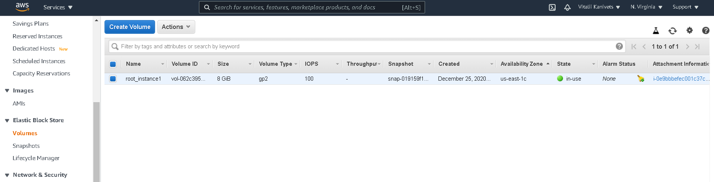
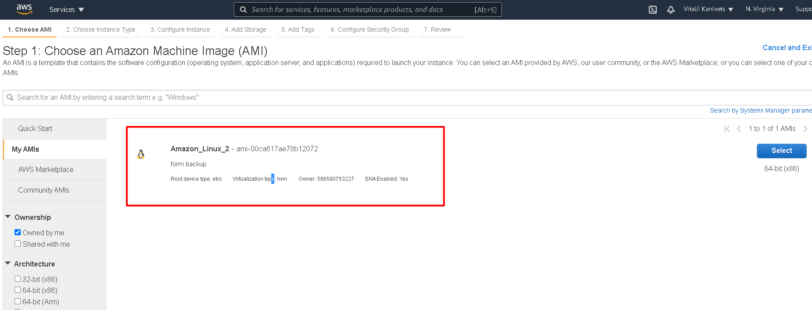
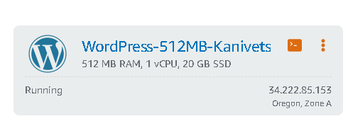
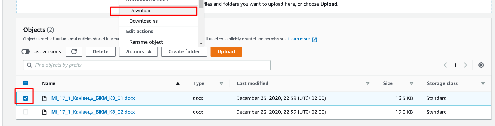
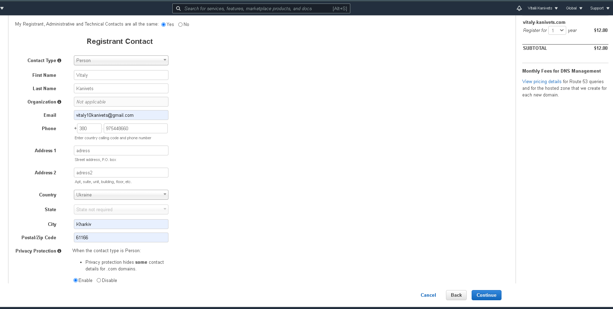

## Task2.2

## 1. Read the terms of Using the AWS Free Tier and the ability to control their own costs.

There are three types of offers on the free tier:
- always free;
- 12 months free;
- trials.

At the "always tier", products such as Amazon DynamoDB 25 GB storage, AWS Lambda 1 million requests per month, Amazon Glacier 10 GB retrievable data, AWS CpdePipeline1 active container per month, and others are available for free.
The "12 month free" tier includes Amazon EC2 750 hours per month, Amazon S3 5 GB standard storage, Amazon RDS 750 hours db.t2.micro database instance usage (with applicable DB engines) per month, AWS Data Pipeline 3 preliminary low frequency conditions and others.
"Trials" include Amazon SageMaker 250 hours of notebook usage per t2.medium instance, Amazon Redshift 2 months, and more.

## 2. Register with AWS.

> 

## 3. Review the 10-minute example Launch a Linux Virtual Machine with Amazon Lightsail. Repeat, create your own VM in the AWS cloud and connect to it.

- Select your instance location

> 

- Pick your instance image

> 

- Launch script

> 

- SSH key pair manager (default) and Enable automatic shapshots

> 

- Choose your instance plan

> 

- Identify your instance and create

> 

- The Instance is reade for connection

> 

- Connect to instance

> 

## 4. Launch another Linux Virtual Machine without Amazon Lightsail.

- Step 1: Choose an Amazon Machine Image (AMI)

> 

- Step 2: Choose an Instance Type

> 

- Step 3: Configure Instance Details

> 

- Step 4: Add Storage

> 

- Step 5: Add Tags

> 

- Step 6: Configure Security Group

> 

- Step 7: Review Instance Launch

> 

- Select an existing key pair

> 

- Check an instance

> 

- Connect to instance using MobaXterm

> 

## 5. Create a snapshot of your instance to keep as a backup.

- Select Volumes

> 

- Create a shapshot

> 

> 

> 

> 

## 6. Create and attach a Disk_D (EBS) to your instance to add more storage space. Create and save some file on Disk_D.

- Create Volume

> 

> 

- Attach a Disk to my instance

> 

- mount Disk_D

> 

- Create and save some file

> 

## 7. Launch the third instance from backup.

- Create Image from EBS snapshot

> 

> 

- Launch the third instance from backup

> 

> 

> 

> 

> 

> 

> 

> 

> 

## 8. Detach Disk_D from the 2nd instance and attach disk_D to the new instance.

- Detach Disk_D from the 2nd instance

> 

- Attach disk_D to the new instance.

> 

> 

## 9. Launch and configure a WordPress instance with Amazon Lightsail

- Create an instance

> 

- Choose your instance image

> 

- Choose an instance plan

> 

- Enter a name for your instance. 

> 

- On the Instances tab of the Lightsail home page, choose the SSH quick-connect icon for your WordPress instance.

> 

- After the browser-based SSH client window opens, enter the following command to retrieve the default application password:

> 

-  In a browser, go to: http://34.222.85.153/wp-login.php

> 

> 

- On the Instances tab of the Lightsail home page, choose your running WordPress instance.

> 

- Choose the Networking tab, then choose Create static IP.

> 

- The static IP location, and attached instance are pre-selected based on the instance that you chose earlier in this tutorial.

> 

- Name your static IP, then choose Create. 

> 

- On the Networking tab of the Lightsail home page, choose Create DNS zone

> 

- Enter your domain, then choose Create DNS zone. 

> 

- Make note of the name server address listed on the page. 

ns-1699.awsdns-20.co.uk
ns-18.awsdns-02.com
ns-1152.awsdns-16.org
ns-576.awsdns-08.net

> 

- After management of your domain's DNS records are transferred to Lightsail, add an A record to point the apex of your domain to your WordPress instance

> 

> 

## 10. Store and Retrieve a File. Creating your own repository.

- Enter the Amazon S3 Console

> 

- In the S3 dashboard, click Create Bucket.

> 

> 

> 

> 

- Upload a File

> 

> 

- To select a file to upload, either click Add files and select a sample file that you would like to store OR Drag and Drop a file on the upload box. Select Next after you have selected a file to upload.

> 

> 

- Retrieve the Object. Select the checkbox next to the file you would like to download, then select Download.

> 

- Delete the Object and Bucket. Select the checkbox next to the file you want to delete and select More > Delete.

> 

> 

- Click on Amazon S3 to view all your buckets in the region. Click to the right of the bucket name of the bucket you created to selected it, then click Delete .

> 

> 

> 

## 11. Create a user AWS IAM, configure CLI AWS and upload any files to S3.

- Step 1: Create an AWS IAM User

> 

> 

> 

> 

> 

> 

- Step 2: Install and Configure the AWS CLI

> 

> 

- Step 3: Using the AWS CLI with Amazon S3

> 

> 

> 

> 

> 

> 

## 12. Explore the possibilities of creating your own domain and domain name for your site.

- Step 1: Obtain a Static URL

> 

> 

> 

> 

> 

- Step 2: Register a Domain Name

> 

> 

> 

Example your domain

> 

- Step 3: Configure DNS

Created my domain zone

> 

Created a new record

> 

> 

## 13. Review the 10-minute example Deploy Docker Containers on Amazon Elastic Container Service. Repeat, create a cluster, and run the online demo application.

- Step 1: Set up your first run with Amazon ECS

> 

- Step 2: Create a task definition

> 

- Step 3: Configure your service

> 

> 

- Step 4: Configure your cluster

> 

- Step 5: Launch and view your resources

> 

> 

- Step 6: Open the Sample Application

> 

    EC2 > Load Balancers

> 

> 

- Step 7: Delete Your Resources

> 

> 

> 

After you update your service, select Delete.

> 

> 

Delete your load balancers:

> 

> 

Delete your claster:

> 

## 14. Create a static website on Amazon S3, publicly available. Post on the page your own photo, the name of the educational program, the list of AWS services with which the student worked within the educational program or earlier and the full list with links of completed labs (based on tutorials or qwiklabs or re:Invent 2020). Provide the link to the website in your report.

- Step 1: Create a bucket

> 

- Step 2: Enable static website hosting

> 

Step 3: Edit S3 Block Public Access settings

> 

> 

> 

- Step 4: Add a bucket policy that makes your bucket content publicly available

> 

- Step 5: Configure an index document

> 

- Step 6: Test your website endpoint

> 

> [Link to static site](http://site-epam-devops.com.s3-website-us-east-1.amazonaws.com/)
