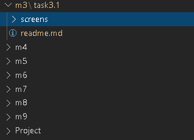

## Task3.

## PART 1

## 1.DownloadMySQL server for your OS on VM.

<body>
<figure class="img">
    
    <figcaption>Когда-нибудь котёнок выберется из лужи</figcaption>
</figure>
</body>

## 2.Install MySQL server on VM.

## 3.Select a subject area anddescribe the database schema,(minimum 3 tables)

## 4.Create a database on the server through the console.

## 5.Fill in tables.

## 6.Constructand execute SELECToperator with WHERE,GROUP BYand ORDER BY.

## 7.Execute other different SQL queries DDL, DML, DCL. 

## 8.Create a database of new users with different privileges. Connect to the database as a new user and verify that the privilegesallow or deny certain actions.

## 9.Make a selection from the main tableDBMySQL.

## PART 2

## 10.Make backup of your database.

## 11.Delete the table and/or part of the data in the table.

## 12.Restore your database.

## 13.Transfer your local database to RDS AWS.

## 14.Connect to your database.

## 15.Execute SELECToperatorsimilarstep6.

## 16.Create thedumpof yourdatabase.

## PART 3

## 17.Create an Amazon DynamoDB table

## 18.Enter data into an Amazon DynamoDB table.

## 19.Query an Amazon DynamoDB tableusing QueryandScan.