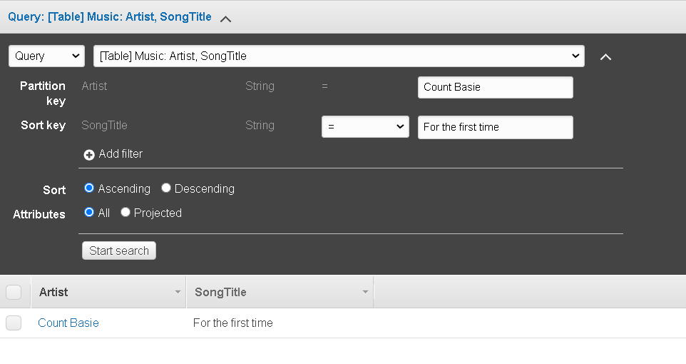

## Task3.

## PART 1

## 1.Download MySQL server for your OS on VM and Install MySQL server on VM.

#### Поднимаем виртуальную машину на которой будем устанавливать MySQL server

||
|:--:|
|<b>Img. 1.1 - Окно PowerShell с поднятием виртуальной машины</b>|

#### Посмотрит что произошло в VirtualBox

||
|:--:|
|<b>Img. 1.2 - Поднятый сервер в отображается в окне VirtualBox</b>|

#### Подключаемся к нашей виртуальной машине

||
|:--:|
|<b>Img. 1.3 - Окно MobaXterm</b>|

#### Устанавливаем MySQL server

||
|:--:|
|<b>Img. 1.4 - Установка MySQL server</b>|
||
||
|<b>Img. 1.5 - Версия MySQL server</b>|

## 3.Select a subject area anddescribe the database schema,(minimum 3 tables)

#### Я буду описывать покупателей которые делают различные покупки на каком-либо сайте. Всего будет 5 таблиц: customer, product, product_photo, cart and cart_product.

||
|:--:|
|<b>Img. 1.6 - ER диаграмма</b>|

## 4.Create a database on the server through the console.

#### Входим в базу данных

||
|:--:|
|<b>Img. 4.1 - Вход в MySQL server</b>|

#### Создаем database

||
|:--:|
|<b>Img. 4.1 - Database</b>|
||
||
|<b>Img. 4.2 - Таблица customer</b>|
||
||
|<b>Img. 4.3 - Таблица product</b>|
||
||
|<b>Img. 4.4 - Таблица product_photo</b>|
||
||
|<b>Img. 4.5 - Таблица cart</b>|
||
||
|<b>Img. 4.6 - Таблица cart_product</b>|

#### Полученые таблицы 

||
|:--:|
|<b>Img. 4.7 - Список созданых таблиц</b>|

## 5.Fill in tables.

||
|:--:|
|<b>Img. 5.1 - Заполнил таблицу customer</b>|
||
||
|<b>Img. 5.2 - Заполнил таблицу product</b>|
||
||
|<b>Img. 5.4 - Заполнил таблицу product_photo</b>|
||
||
|<b>Img. 5.5 - Таблица cart (сделали корзины для некоторых покупателей)</b>|
||
||
|<b>Img. 5.6 - Таблица cart_product</b>|

## 6.Constructand execute SELECT operator with WHERE,GROUP BY and ORDER BY. Execute other different SQL queries DDL, DML, DCL.

#### Выведем имена и email всех покупателей
    
```mysql
    SELECT name, email FROM customer;    
```
||
|:--:|
|<b>Img. 6.1 - имена и email всех покупателей</b>|

#### Выведем все с таблицы product где цена больше 86000
    
```mysql
    SELECT * FROM product WHERE price > 86000;    
```
||
|:--:|
|<b>Img. 6.1.1 - цена больше 86000</b>|

#### Выведем номера телефоном покупателей (кто совершил покупки) у которых сумма заказа меньше 700000

```mysql
    SELECT c.phone AS Phone, SUM(p.price) AS order_price 
    FROM customer c LEFT JOIN cart on cart.customer_id=c.id     
    JOIN cart_product cp ON cp.cart_id=cart.id      
    LEFT JOIN product p ON p.id=cp.product_id 
    GROUP BY c.name HAVING order_price < 70000;
```
||
|:--:|
|<b>Img. 6.2 - телефон покупателя с покупкой на сумму менее 70000</b>|

#### Выведем имена покупателей с ценой их заказа и id продукта
    
```mysql
    SELECT c.name, cp.product_id, p.price
    FROM customer c LEFT JOIN cart on cart.customer_id=c.id
    JOIN cart_product cp ON cp.cart_id=cart.id 
    LEFT JOIN product p ON p.id=cp.product_id;    
```

||
|:--:|
|<b>Img. 6.3 - имена, продукты и цены</b>|

#### Выведем имена покупателей и сумму их заказа сгрупирированых по имени

```mysql
    SELECT c.name, SUM(p.price) AS order_price
    FROM customer c LEFT JOIN cart on cart.customer_id=c.id
    JOIN cart_product cp ON cp.cart_id=cart.id 
    LEFT JOIN product p ON p.id=cp.product_id 
    GROUP BY c.name;    
```

||
|:--:|
|<b>Img. 6.4 - имена и сумма заказа</b>|

#### Выведем имена покупателей и сумму их заказа сгрупирированых по именим и сортирированы по сумме заказа

```mysql
    SELECT c.name, SUM(p.price) AS order_price
    FROM customer c LEFT JOIN cart on cart.customer_id=c.id
    JOIN cart_product cp ON cp.cart_id=cart.id 
    LEFT JOIN product p ON p.id=cp.product_id 
    GROUP BY c.name
    ORDER BY order_price;    
```
||
|:--:|
|<b>Img. 6.5 - групирированная и сортированая таблица с именами и сумой заказа</b>|

#### Используем команды DDL

##### Изменим имя столбца в таблицы customer

```mysql
    ALTER TABLE customer CHANGE  name first_name  VARCHAR(50);   
```
||
|:--:|
|<b>Img. 6.6 - именение таблицы</b>|

##### Удалим столбец в таблице customer

```mysql
    ALTER TABLE customer DROP COLUMN email;
```
||
|:--:|
|<b>Img. 6.7 - удаление стлбца</b>|

#### Используем команды DML

##### Обновление информации в базе данных

```mysql
    UPDATE product SET name = 'iPhone 11' WHERE id = 4;
```
||
|:--:|
|<b>Img. 6.8 - именение данных таблицы</b>|

##### Удалим строку в таблице

```mysql
    DELETE FROM customer WHERE id = 3;
```
||
|:--:|
|<b>Img. 6.9 - удаление строки</b>|

#### Используем команды DCL

##### Дать привелегии пользователю vagrant

```mysql
    GRANT ALL PRIVILEGES ON DATABASENAME.shop TO vagrant@localhost;
```
||
|:--:|
|<b>Img. 6.10 - привелегии</b>|

##### Удалим привелегию

```mysql
    REVOKE SELECT ON product FROM vagrant;
```
||
|:--:|
|<b>Img. 6.9 - удаление привелегии</b>|

## 7.Create a database of new users with different privileges. Connect to the database as a new user and verify that the privilegesallow or deny certain actions.

#### Создаем новых пользователей для базы данных

```mysql
    CREATE USER 'new_user'@'localhost' IDENTIFIED BY 'password';
```
||
|:--:|
|<b>Img. 7.1 - создание пользователей</b>|

####  Раздаем привелегии

```mysql
    GRANT <permission type> ON <database>.<table> TO '<username>'@'<host>';
```
||
|:--:|
|<b>Img. 7.2 - раздача привелегий</b>|

### Проверка доступа

||
|:--:|
|<b>Img. 7.3 - Проверка доступа у user1</b>|
||
||
|<b>Img. 7.4 - Проверка доступа у user2</b>|
||
||
|<b>Img. 7.5 - Проверка доступа у user3</b>|

## 8.Make a selection from the main table DB MySQL.

||
|:--:|
||
|<b>Img. 8.1 - some selection from main table DB MySQL</b>|

## PART 2

## 9.Make backup of your database.

||
|:--:|
|<b>Img. 9.1 - Создание backup</b>|

## 10.Delete the table and/or part of the data in the table.

||
|:--:|
|<b>Img. 10.1 - удалил базу данных</b>|

## 11.Restore your database.

||
|:--:|
||
|<b>Img. 8.1 - Restore the database.</b>|

## 12.Transfer your local database to RDS AWS and connect to your database.

### Create database on AWS RDS

||
|:--:|
||
||
||
||
||
|<b>Img. 12.1 - Create database</b>|

### Open port 3306

||
|:--:|
|<b>Img. 12.7 - Open port</b>|

### Connect to RDS and create Database shop

||
|:--:|
|<b>Img. 12.8 - Создание базы данных shop on RDS</b>|

### Transfer your local database to RDS AWS

||
|:--:|
|<b>Img. 12.9 - Transfer database to RDS AWS</b>|

## 14.Execute SELECT operator similar step 6.

#### Выведем имена всех покупателей где id > 1
    
```mysql
    SELECT first_name FROM customer WHERE id > 1;    
```
||
|:--:|
|<b>Img. 14.1 - имена всех покупателей</b>|

#### Выведем name and email покупателей у которых сумма заказа > 700000

```mysql
    SELECT c.first_name, c.phone, SUM(p.price) AS order_price 
    FROM customer c LEFT JOIN cart on cart.customer_id=c.id     
    JOIN cart_product cp ON cp.cart_id=cart.id      
    LEFT JOIN product p ON p.id=cp.product_id 
    GROUP BY c.first_name HAVING order_price > 70000;
```
||
|:--:|
|<b>Img. 14.2 - имена и телефоны покупателей с покупкой на сумму более 70000</b>|

## 15.Create the dump of your database.

||
|:--:|
|<b>Img. 15.1 - dump of database</b>|

## PART 3

## 16.Create an Amazon DynamoDB table

||
|:--:|
||
|<b>Img. 16.1 - Create DynamoDB table</b>|

## 17.Enter data into an Amazon DynamoDB table.

||
|:--:|
|<b>Img. 17.1 - Enter data into an DynamoDB table</b>|

## 18.Query an Amazon DynamoDB table using Query and Scan.

### Scan

||
|:--:|
||
||
|<b>Img. 16.1 - Using Scan</b>|

### Query

||
|:--:|
||
|<b>Img. 16.1 - Using Query</b>|