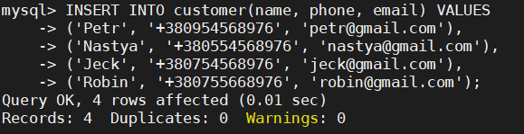

## Task3.1

## PART 1

## 1.Download MySQL server for your OS on VM and Install MySQL server on VM.

#### We raise the virtual machine on which we will install the MySQL server

|  |
|:--:|
| <b> Img. 1.1 - PowerShell window with raising a virtual machine </b> |

#### See what happened in VirtualBox

|  |
|:--:|
| <b> Img. 1.2 - The lifted server is displayed in the VirtualBox window </b> |

#### Connecting to our virtual machine

|  |
|:--:|
| <b> Img. 1.3 - MobaXterm Window </b> |

#### Install MySQL server

|  |
|:--:|
| <b> Img. 1.4 - Installing MySQL server </b> |
||
|  |
| <b> Img. 1.5 - MySQL server version </b> |

## 3.Select a subject area anddescribe the database schema, (minimum 3 tables)

#### I will describe buyers who make various purchases on any site. There will be 5 tables in total: customer, product, product_photo, cart and cart_product.

|  |
|:--:|
| <b> Img. 1.6 - ER diagram </b> |

## 4.Create a database on the server through the console.

#### Enter the database

|  |
|:--:|
| <b> Img. 4.1 - Login to MySQL server </b> |

#### Create database

|  |
|:--:|
| <b> Img. 4.1 - Database </b> |
||
|  |
| <b> Img. 4.2 - The customer table </b> |
||
|  |
| <b> Img. 4.3 - Product table </b> |
||
|  |
| <b> Img. 4.4 - Product_photo table </b> |
||
|  |
| <b> Img. 4.5 - The cart table </b> |
||
|  |
| <b> Img. 4.6 - The cart_product table </b> |

#### Received tables

|  |
|:--:|
| <b> Img. 4.7 - List of tables created </b> |

## 5.Fill in tables.

|  |
|:--:|
| <b> Img. 5.1 - Populated the customer table </b> |
||
|  |
| <b> Img. 5.2 - Populated the product table </b> |
||
|  |
| <b> Img. 5.4 - Populated the product_photo table </b> |
||
|  |
| <b> Img. 5.5 - Cart table (made baskets for some customers) </b> |
||
|  |
| <b> Img. 5.6 - The cart_product table </b> |

## 6.Constructand execute SELECT operator with WHERE, GROUP BY and ORDER BY. Execute other different SQL queries DDL, DML, DCL.

#### Display the names and email addresses of all buyers
    
```mysql
    SELECT name, email FROM customer;
```

|  |
|:--:|
| <b> Img. 6.1 - names and emails of all buyers </b> |

#### Display everything from the product table where the price is more than 86000
    
```mysql
    SELECT * FROM product WHERE price> 86000;
```

|  |
|:--:|
| <b> Img. 6.1.1 - the price is more than 86000 </b> |

#### Display phone numbers of buyers (who made purchases) whose order amount is less than 700,000

```mysql
    SELECT c.phone AS Phone, SUM (p.price) AS order_price
    FROM customer c LEFT JOIN cart on cart.customer_id = c.id
    JOIN cart_product cp ON cp.cart_id = cart.id
    LEFT JOIN product p ON p.id = cp.product_id
    GROUP BY c.name HAVING order_price <70000;
```

|  |
|:--:|
| <b> Img. 6.2 - customer's phone number with a purchase of less than 70,000 </b> |

#### Display the names of buyers with the price of their order and product id
    
```mysql
    SELECT c.name, cp.product_id, p.price
    FROM customer c LEFT JOIN cart on cart.customer_id = c.id
    JOIN cart_product cp ON cp.cart_id = cart.id
    LEFT JOIN product p ON p.id = cp.product_id;
```

|  |
|:--:|
| <b> Img. 6.3 - names, products and prices </b> |

#### Display the names of customers and the amount of their order grouped by name

```mysql
    SELECT c.name, SUM (p.price) AS order_price
    FROM customer c LEFT JOIN cart on cart.customer_id = c.id
    JOIN cart_product cp ON cp.cart_id = cart.id
    LEFT JOIN product p ON p.id = cp.product_id
    GROUP BY c.name;
```

|  |
|:--:|
| <b> Img. 6.4 - names and order amount </b> |

#### Display the names of customers and the amount of their order, grouped by name and sorted by order amount

```mysql
    SELECT c.name, SUM (p.price) AS order_price
    FROM customer c LEFT JOIN cart on cart.customer_id = c.id
    JOIN cart_product cp ON cp.cart_id = cart.id
    LEFT JOIN product p ON p.id = cp.product_id
    GROUP BY c.name
    ORDER BY order_price;
```

|  |
|:--:|
| <b> Img. 6.5 - grouped and sorted table with names and order amount </b> |

#### Using DDL Commands

##### Change column name in customer tables

```mysql
    ALTER TABLE customer CHANGE name first_name VARCHAR (50);
```

|  |
|:--:|
| <b> Img. 6.6 - naming a table </b> |

##### Let's delete a column in the customer table

```mysql
    ALTER TABLE customer DROP COLUMN email;
```

|  |
|:--:|
| <b> Img. 6.7 - deleting a column </b> |

#### Using DML Commands

##### Updating information in the database

```mysql
    UPDATE product SET name = 'iPhone 11' WHERE id = 4;
```

|  |
|:--:|
| <b> Img. 6.8 - naming table data </b> |

##### Let's delete a row in the table

```mysql
    DELETE FROM customer WHERE id = 3;
```

|  |
|:--:|
| <b> Img. 6.9 - deleting a line </b> |

#### Using DCL Commands

##### Give privileges to vagrant user

```mysql
    GRANT ALL PRIVILEGES ON DATABASENAME.shop TO vagrant @ localhost;
```

|  |
|:--:|
| <b> Img. 6.10 - privileges </b> |

##### Remove the privilege

```mysql
    REVOKE SELECT ON product FROM vagrant;
```

|  |
|:--:|
| <b> Img. 6.9 - removing privileges </b> |

## 7.Create a database of new users with different privileges. Connect to the database as a new user and verify that the privilegesallow or deny certain actions.

#### Create new users for the database

```mysql
    CREATE USER 'new_user' @ 'localhost' IDENTIFIED BY 'password';
```

|  |
|:--:|
| <b> Img. 7.1 - creating users </b> |

#### Distributing privileges

```mysql
    GRANT <permission type> ON <database>. <table> TO '<username>' @ '<host>';
```

|  |
|:--:|
| <b> Img. 7.2 - distribution of privileges </b> |

### Access check

|  |
|:--:|
| <b> Img. 7.3 - Checking access for user1 </b> |
||
|  |
| <b> Img. 7.4 - Checking access for user2 </b> |
||
|  |
| <b> Img. 7.5 - Checking access for user3 </b> |

## 8.Make a selection from the main table DB MySQL.

|  |
|:--:|
|  |
| <b> Img. 8.1 - some selection from main table DB MySQL </b> |

## PART 2

## 9.Make backup of your database.

|  |
|:--:|
| <b> Img. 9.1 - Creating a backup </b> |

## 10.Delete the table and / or part of the data in the table.

|  |
|:--:|
| <b> Img. 10.1 - deleted the database </b> |

## 11.Restore your database.

|  |
|:--:|
|  |
| <b> Img. 8.1 - Restore the database. </b> |

## 12.Transfer your local database to RDS AWS and connect to your database.

### Create database on AWS RDS

|  |
|:--:|
|  |
|  |
|  |
|  |
|  |
| <b> Img. 12.1 - Create database </b> |

### Open port 3306

|  |
|:--:|
| <b> Img. 12.7 - Open port </b> |

### Connect to RDS and create Database shop

|  |
|:--:|
| <b> Img. 12.8 - Create a shop on RDS database </b> |

### Transfer your local database to RDS AWS

|  |
|:--:|
| <b> Img. 12.9 - Transfer database to RDS AWS </b> |

## 14.Execute SELECT operator similar step 6.

#### Display the names of all buyers where id> 1
    
```mysql
    SELECT first_name FROM customer WHERE id> 1;
```

|  |
|:--:|
| <b> Img. 14.1 - names of all buyers </b> |

#### Display the name and email of buyers whose order amount is> 700000

```mysql
    SELECT c.first_name, c.phone, SUM (p.price) AS order_price
    FROM customer c LEFT JOIN cart on cart.customer_id = c.id
    JOIN cart_product cp ON cp.cart_id = cart.id
    LEFT JOIN product p ON p.id = cp.product_id
    GROUP BY c.first_name HAVING order_price> 70000;
```

|  |
|:--:|
| <b> Img. 14.2 - names and phone numbers of buyers with purchases over 70,000 </b> |

## 15.Create the dump of your database.

|  |
|:--:|
| <b> Img. 15.1 - dump of database </b> |

## PART 3

## 16.Create an Amazon DynamoDB table

|  |
|:--:|
|  |
| <b> Img. 16.1 - Create DynamoDB table </b> |

## 17.Enter data into an Amazon DynamoDB table.

|  |
|:--:|
| <b> Img. 17.1 - Enter data into an DynamoDB table </b> |

## 18.Query an Amazon DynamoDB table using Query and Scan.

### Scan

|  |
|:--:|
|  |
|  |
| <b> Img. 16.1 - Using Scan </b> |

### Query

|  |
|:--:|
|  |
| <b> Img. 16.1 - Using Query </b> |
