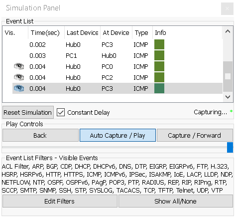
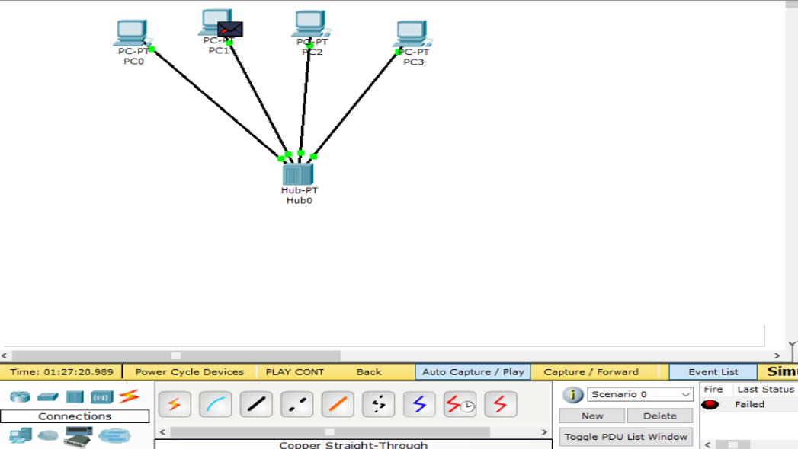

## Task4.1

### 1. Зібрали наступний проект (рис 1.1), який містить в собі: 4 ПК типу PCPT, Концентратор (Hub-PT). Кожен комп'ютер повинен бути з'єднаний з концентратором за допомогою крученої пари (Copper Straight-through).

|  |
|:--:|
| <b> Img. 1.1 - Топологія 1 </b> |

### 2. Кожному ПК привласнити унікальну IP адресу (таб. 1.1).  В полі ip address необхідно ввести відповідну адресу, а в полі Subnet Mask - відповідно цьому адресу маску (рис. 2.1).

#### Значення маски для адреси: 255.255.255.0.

#### table 1.1

|№ PC| Ip address|
|:--:|:--:|
|PC0| 192.168.0.1|
|PC1| 192.168.0.2|
|PC2| 192.168.0.3|
|PC3| 192.168.0.4|

|  |
|:--:|
| <b> Img. 2.1 - Призначення адреси локальної машині PC0</b> |
|  |
| <b> Img. 2.2 - Призначення адреси локальної машині PC1</b> |
|  |
| <b> Img. 2.3 - Призначення адреси локальної машині PC2</b> |
|  |
| <b> Img. 2.4 - Призначення адреси локальної машині PC03</b> |

### 3. Перевірити працездатність отриманої мережі шляхом здійснення Інтернет запитів (ICMP пакетів) від одного ПК до іншого. Для присвоєння такого пакета ПК використовуйте кнопку ADD SIMPLE PDU в правій частині робочого вікна. Після цього клацніть лівою кнопкою миші на локальну машину-джерело, потім - на машину-одержувача. Перевірити працездатність мережі.

|  |
|:--:|
| <b> Img. 3.1 - Пацездатність від PC0 до PC1</b> |

#### Інші варінти відповідно теж працездатні.

### 4. Перейти в режим Simulation і за допомогою кнопки Event List викликати вікно відображення подій в мережі Simulation Panel. Використовуючи кнопку Auto Capture / Play запустити симуляцію роботи ICMP пакетів. Простежити просування пакетів по мережі і зберегти даний скріншот.
### 5. Простежити за порядком і шляхом проходження пакетів у вікні Simulation Panel (рис. 5.1). Зберегти даний скріншот.

|  |
|:--:|
| <b> Img. 5.1 - Simulation Panel</b> |

### 6. Переглянути інформацію о пакетах з вікна Simulation Panel і їх відповідність моделі OSI шляхом подвійного клацання по пакету в вікні (рис. 6.1).

|  |
|:--:|
| <b> Img. 6.1 - Відповідність пакета моделі OSI</b> |

#### На рис. 6.1 ми можемо побачити  шлях пакета по рівням моделі OSI.

### 7. Видалити IP адреса з кожною локальною машини PC0 - PC3. Повторити пункти 5 - 7. Проаналізувати відмінності в роботі мережі.

|  |
|:--:|
| <b> Img. 7.1 - Видалили IP адреса та пустили пакет з PC0 до PC1</b> |

#### Як видно на рисунку, статус пакета помічений як «Failed». Із цього можна зробити висновок, що без IP-адрес навіть найпростіша мережа не буде працювати.

### 8. Зібрати наступний проект (рис. 8.1). У нього входять: PC0-PC5, Server, 2 Hubs. Однойменні пристрої з'єднуються за допомогою кросового кабелю (Copper Cross-over). 

#### Кожному мережному компоненту привласнити IP адрес з наступної таблиці:

|||
|:--:|:--:|
|PC0| 192.168.0.1|
|PC1| 192.168.0.2|
|PC2| 192.168.0.3|
|PC3| 192.168.0.4|
|PC4| 192.168.0.6|
|PC5| 192.168.0.7|
|Server| 192.168.0.5|

#### Значення маски для адреси: 255.255.255.0.

|  |
|:--:|
| <b> Img. 8.1 - Топологія 2</b> |

|  |  |  |
|:--:|:--:|:--:|
| Призначення адреси локальної машині PC0|Призначення адреси локальної машині PC1|Призначення адреси локальної машині PC2|
|  |  |  |
| Призначення адреси локальної машині PC3|Призначення адреси локальної машині PC4|Призначення адреси локальної машині PC5|
||||
||Призначення адреси для Server||

### 9. Перевірити працездатність мережі.

|  |
|:--:|
| <b> Gif. 9.1 - ICMP пакет від PC0 до PC4</b> |

#### Як видно з gif. 9.1, мережа працездатна.

#### Нижче приведена link на проект

#### [Топологія 2](t-2.pkt)

### 10. Створити новий проект, який включає в себе: 4 ПК типу PC-PT, Комутатор (Switch). Кожен комп'ютер повинен бути з'єднаний з концентратором за допомогою крученої пари (Copper Straight-through) (рис. 10.1).

|  |
|:--:|
| <b> Img. 10.1 - Топологія 3 з вписаними Ip адресами</b> |

|  |
|:--:|
| <b> Img. 10.2 - Відправка пакета з PC0 до PC2</b> |

### 11. Для даної топології повторити пункти 2-9. Проаналізувати відмінності в роботі мережі Топології 1 і Топології 3.

#### З рис. 10.2 видно, що комутатор працює на перших двух рівнях моделі OSI. Тому робимо висновок, що комутатор може працювати, яка на 1 та 2 рівні, а концентратор працює лиши на 1 рівні. Також важлива деталь у тому, що концентратор пересилаю призначений пакет усім в мережі, а комутатор спочатку робить розвітку і коли він дізнався всі мак адрема та ip адреса, то пересилає пакет лише назаченому отримувачу.

#### link [Топологія 3 (file .pkt)](t-3.pkt)

### 12. Розширити проект (рис. 12.1). У нього входять: 8 ПК типу PC-PT, 2 комутатори (Switch). Кожен комп'ютер повинен бути з'єднаний з комутатором за допомогою крученої пари (Copper Straight-through), комутатори між собою з'єднуються за допомогою кросового кабелю (Copper Cross-over).

#### Кожному мережному компоненту привласнити IP адрес з наступноїтаблиці:

|||
|:--:|:--:|
|PC0| 192.168.0.1|
|PC1| 192.168.0.2|
|PC2| 192.168.0.3|
|PC3| 192.168.0.4|
|PC4| 192.168.0.5|
|PC5| 192.168.0.6|
|PC6| 192.168.0.7|
|PC7| 192.168.0.8|

#### Значення маски для адреси: 255.255.255.0.

#### Перевірити працездатність мережі приведена нижче

|  |
|:--:|
| <b> Gif. 12.1 - Розширина Топологія 3 з вписаними Ip адресами</b> |

#### Як видно з gif. 12.1, топологія працює коректно.

#### link [Розширена топоологія 3 (file .pkt)](t-3_modern.pkt)

###  13. Існуючу мережу розбити на дві рівні підмережі. І з'єднати їх за допомогою маршрутизатора Router-PT з декількома портами (рис. 13.1). Маршрутизатор і комутатори з'єднати між собою за допомогою оптоволокна (Fiber).

#### Комп'ютерам РС4 – РС7 привласнити IP адреси з наступної таблиці:

|||
|:--:|:--:|
|PC4| 192.168.1.1|
|PC5| 192.168.1.1|
|PC6| 192.168.1.1|
|PC7| 192.168.1.1|

#### Значення маски залишається колишнім: 255.255.255.0.

|  |
|:--:|
| <b> Img. 13.1 - Топологія 4</b> |
|  |
| <b> Img. 13.2 - ip на роутері для лівою подмережі</b> |
|  |
| <b> Img. 13.3 - ip на роутері для правої подмережі</b> |
|  |
| <b> Img. 13.4 - Приклад задання Gateway для лівою та правою підмережі</b> |

#### Перевірка працездатності

|  |
|:--:|
| <b> Gif. 13.5 - Розширина Топологія 3 з вписаними Ip адресами</b> |

#### Отже, маршрутизатор може поєднанати двох або більше мереж і керує процесом маршрутизації на 3 рівні моделі OSI (як видно на рис. 13.6) між різними сегментами мережі.

|  |
|:--:|
| <b> Img. 13.6 - Приклад задання Gateway для лівою та правою підмережі</b> |

#### Основна відмінність роутера від світча пов'язано з функціональністю. Так, свитчи потрібні для того, щоб два або більше комп'ютерів могли обмінюватися даними всередині однієї мережі. Роутери ж являють собою більш складні апарати: даними можуть обмінюватися і ті ПК, які входять в різні мережі.

#### Крім цього роутери відрізняються від світчей тим, що володіють великим набором функцій. Так, вони можуть виконувати функцію файрволла, захищаючи підключення, шифрують дані і трансляцію адрес, що забезпечує більш високий рівень мережевої безпеки.

#### link [Топологія 4 (file .plt)](t-4.pkt)