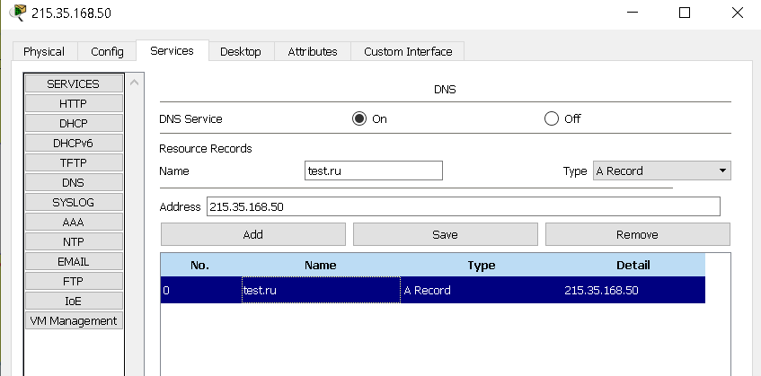

## Task4.2

## Завдання 1.

### Необхідно змоделювати корпоративну мережу організації, яка містить 2  будинки  по  2  поверхи  в  кожному.  Горизонтальна  підсистема  поверху складається з однієї робочої групи по 5 комп'ютерів. Провести аналіз працездатності мережі і її трафіку.

#### Оскільки в завдання не вказано, як об'єднувати робочі групи, то використаємо підмережі.

#### На рис. 1.1 видно, що виходить 4 підмережі (192.168.0.1, 192.168.1.1, 192.168.2.1, 192.168.3.1), для кожного поверху відповідна своя. Кожна робоча група об'єднуєтся комутатором, а для забезпечення підмереж використовуємо маршрутизатор. 

#### Встановили кожному PС свій IP адрес з маскою 255.255.255.0, а також вказали Gateway відповідно до підмережі.

|  |
|:--:|
| <b> Img. 1.1 - Корпоративна мережа організації </b> |

#### Перевіримо працездатність трафіку.

#### Наглядно відправимо ICMP пакет з <b> PC-192.168.0.2 </b> до <b> PC-192.168.2.6  та з PC-192.168.3.6 </b> до <b> PC-192.168.1.2 </b> 

|  |
|:--:|
| <b> Gif. 1.1 - Перевірка працездатності мережі </b> |

#### Як видно з gif 1.1, мережа працює коректно.

#### Для переконання в правильності роботи мережі також використаемо утиліту ping.

|  |
|:--:|
| <b> Img. 1.2 - утиліта ping </b> |

#### Отже, мережа працює

### link [Топологія 1 (file .pkt)](t-1.pkt)

## Завдання 2.

### Необхідно змоделювати корпоративну мережу організації, яка містить 1  будинок  з  чотирма  поверхами.  Горизонтальна  підсистема  поверху складається з двох робочих груп по 3 і 5 комп'ютерів відповідно. Провести логічну структуризацію мережі на 8 підмереж.  Провести  аналіз  працездатності  мережі  і  її трафіку.

#### Щоб побудувати цю мережу  я взяв один маршрутизатор з 8 модулями Fast-Ethernet та 8 комутаторів. На роутері налаштував 8 пімереж, а саме:

|Підмережі|
|:--:|
|192.168.0.1|
|192.168.1.1|
|192.168.2.1|
|192.168.3.1|
|192.168.4.1|
|192.168.5.1|
|192.168.6.1|
|192.168.7.1|

#### З'єднавши отримав наступну картину

|  |
|:--:|
| <b> Img. 2.1 -  Змодельована корпоративна мережа організації</b> |

#### Для переконання в правильності роботи мережі використаємо утиліту ping. Перевіряти бедемо з машини PC-192.168.0.2

|  |
|:--:|
|  |
|  |
|  |
|  |
|  |
|  |
|  |
| <b> Img. 2.2 -  Перевірка працездатності мережі</b> |

### link [Топологія 2 (file .pkt)](t-2.pkt)

## Завдання 3.
### Необхідно  змоделювати  локальну  мережу  комплексу  з  5 одноповерхових будівель. Одна будівля - 1 робоча групапо 6 комп'ютерів. Мережа будується на основі маршрутизатора з одним портом. 

|  |
|:--:|
| <b> Img. 3.1 -  Змодельована корпоративна мережа комплексу з  5 будинків</b> |

#### Як видно на рис. 3.1, ми робили мережу з 5 будівель по 6 хостів. Кожна будівля є підмережою і разом 5 підмереж. Об'єднуються підмережі 3 маршрутизаторами, які налаштовані ip адресами, які вказані на рисунку. Для того, щоб маршрутизатори працювали між собою, зробили в кожному маршрутизаторі таблицю маршрутизацї для всіх можливих варіантів ip  адрес(через консоль, рис. 3.2)  

|  |
|:--:|
| <b> Img. 3.2 -  Налаштування таблиці маршрутизації</b> |

####  Налаштували DNS server на Server-PT (рис. 3.3). Та прописали всім хостам адрес DNS сервера.

|  |
|:--:|
|  |
| <b> Img. 3.3 -  Налаштування DNS server</b> |

#### Для переконання в правильності роботи мережі використаємо утиліту ping та браузера.

|  |
|:--:|
|  |
| <b> Img. 3.4 -  Перевірка працездатності</b> |

### link [Топологія 3 (file .pkt)](t-3.pkt)
