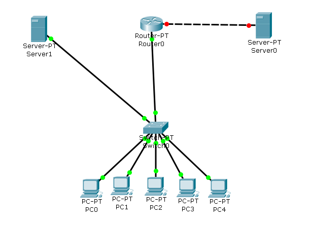
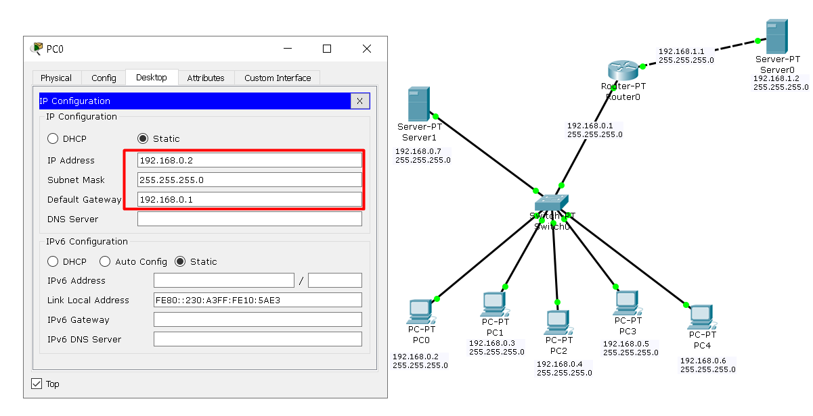
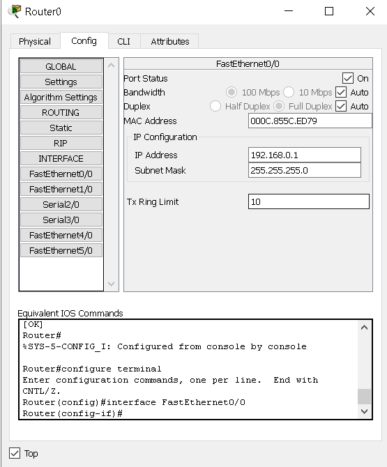
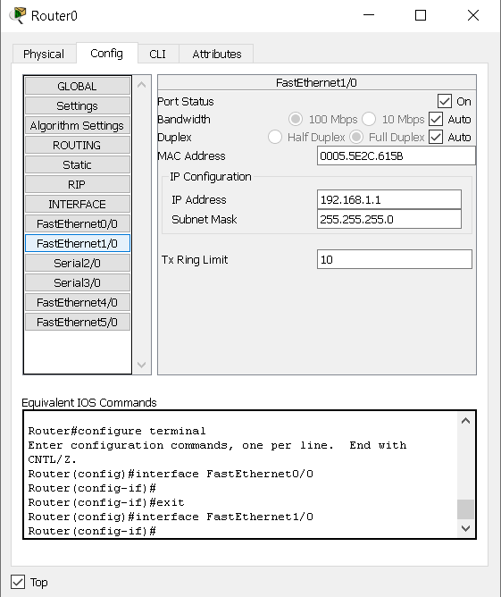
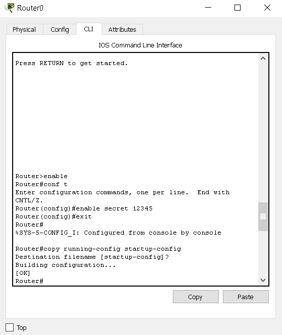
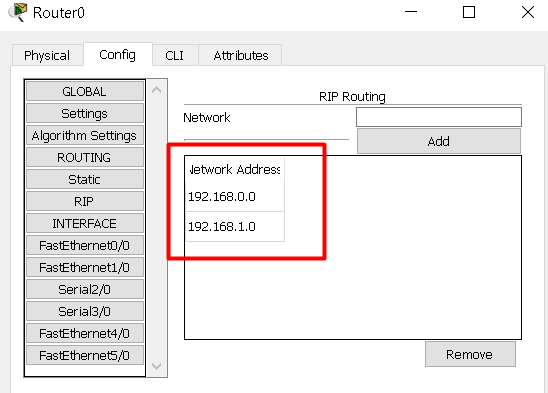
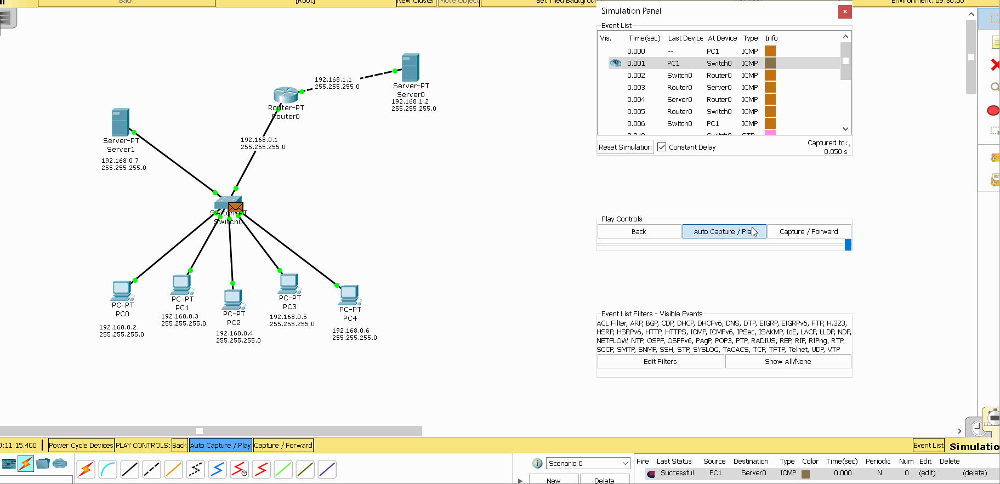
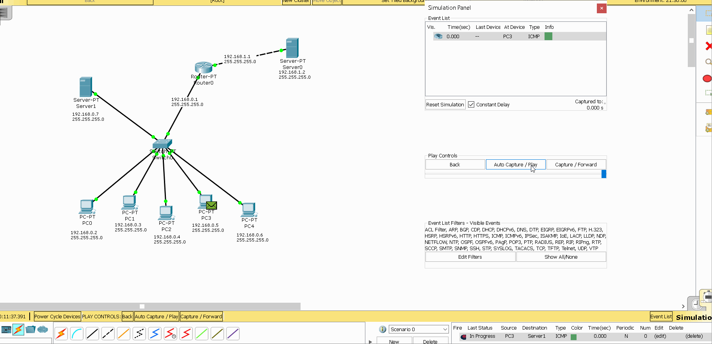
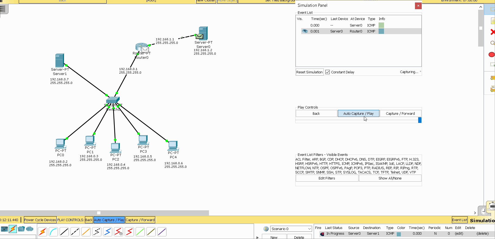

## Task4.3

### Завдання:

### Побудувати локальну мережу, що складається з сегмента на основікомутатора з 5 комп'ютерів і сервера. Комутатор з'єднаний з маршрутизатором, до якого також підключений сервер.Необхідно задати статичні IP адреси мережних інтерфейсів маршрутизаторів, локальних комп'ютерів і серверів. Налаштувати маршрутизацію по протоколу RIP. 

### Домогтися можливості пересилання даних по протоколу ICMP між усіма об'єктами мережі.

#### 1.Розставляємо на робочому полі необхідні вузли, використовуючи браузер в нижній частині вікна (рис. 1.1). З'єднуємо вузли відповідно до завдання за допомогою крученоїпари.

|  |
|:--:|
| <b> Img. 1.1 - Робоче поле</b> |

#### 2. Задамо ip-адреси вузлів сегмента в діапазоні 192.168.0.х, а сервера, підключеного до маршрутизатора -192.168.1.1. Маска підмережі -255.255.255.0. (Рис. 2.1)

|  |
|:--:|
| <b> Img. 2.1 - IP конфігурація робочої станції.</b> |

#### 3. Задамо відповідні ip адреси на інтерфейсах маршрутизатора і включимо ці порти. (Рис. 3.1).

|  |
|:--:|
|  |
| <b> Img. 3.1 - IP конфігурація маршрутизатора.</b> |

#### 4. Зайдемо в Command Line Interface маршрутизатора і за допомогою команди enable secret задамо пароль для доступу і збережемо конфігурацію. (Рис.4.1)

|  |
|:--:|
| <b> Img. 4.1 - Робота в Command Line Interface.</b> |

#### 5. Для налаштування маршрутизації по протоколу RIP відкриємо вкладку Config у вікні властивостей маршрутизатора і виберемо пункт RIP. Задамо там адреси всіх підмереж, яким дозволено спілкування. (Рис. 5.1).

|  |
|:--:|
| <b> Img. 5.1 - Налаштування маршрутизації по протоколу RIP</b> |

#### Перевіряємо доступність робочих станцій. Для цього в правій колонці вибираємо інструмент Addsimple PDU і вибираємо станцію-відправник і станцію-одержувач. Переконуємося, що передача завершена успішно.

|  |
|:--:|
| <b> Gif. 6.1 - Перевірка доступності вузлів в мережі *PC1 - Server0*.</b> |

|  |
|:--:|
| <b> Gif. 6.2 - Перевірка доступності вузлів в мережі *PC3 - Server1*.</b> |

|  |
|:--:|
| <b> Gif. 6.3 - Перевірка доступності вузлів в мережі *Server0 - Server1*.</b> |

#### Виходячі з перевірок можно зробити висновок, що мережа працездатна. Завдяки протоколу RIP нам вдалось налаштувати маршрутизацію в мережах 192.168.0.0 та 192.168.1.0.

#### link [Топологія (file .pkt)](t-1.pkt)