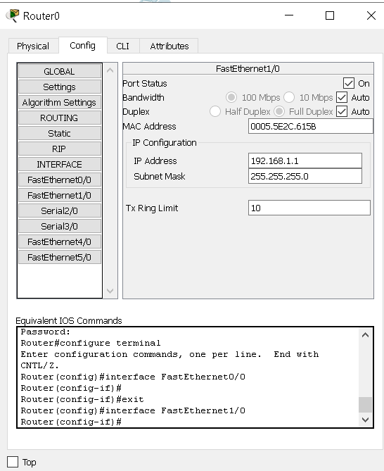
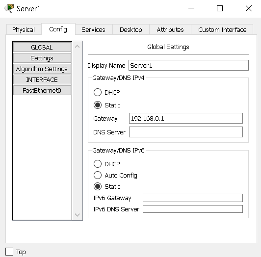

## Task4.4

### 1. Завдання бонусне 

### За основу беремо будь яке завдання task4.2 або 4.3 і у вашу існуючу мережу додаєте роутер,так щоб їх в мережі було не менше двох. І треба налаштувати трафік між двома мережами.Якщо ж у вашій існуючій мережі вже присутньо 2 роутера і трафік налаштований, то виконання цього завдання не потрібно.

#### Завдання виконано в [task4.2 Завдання 3.](https://github.com/Vit-ts/DevOps_online_Kharkiv_2020Q42021Q1/blob/master/m4/task4.2/readme.md)

####  link [Топологія 3 task4.2 (file .pkt)](https://github.com/Vit-ts/DevOps_online_Kharkiv_2020Q42021Q1/blob/master/m4/task4.2/t-3.pkt)

### 2. Завдання бонусне.

### Організувати 2 підмережі. Налаштувати DNS на серверах. 

#### Побудували мережу

|  |
|:--:|
| <b> Img. 1.1 - Топологія</b> |

#### Задамо відповідні ip адреси на інтерфейсах маршрутизатора і включимо ці порти.

|  |
|:--:|
|  |
| <b> Img. 2.2 - IP конфігурація маршрутизатора.</b> |

#### Налаштували ip адреса, Gateway та DNS на хостах(ліва підмережа - 192.168.1.х та права підмережа 192.168.1.х). У серверів адрес відповідно 192.168.1.254 та 192.168.0.254

|  |
|:--:|
| <b> Img. 2.3 - Налаштування хостів</b> |

#### Як видно з рис. 2.3 DNS сервер для всіх 192.168.1.254

#### Налаштували один сервер як DNS та web server (server0.com), а другий лише як web server (server1.com) 

|  | | |  |
|:--:|:--:|:--:|:--:|
|<b> Img. 2.4 - Налаштування Server0</b> | <b> Img. 2.5 - Налаштування Server0</b> |<b> Img. 2.6 - Налаштування Server0</b> |<b> Img. 2.7 - Налаштування Server0</b> |

|  | |  |
|:--:|:--:|:--:|
| <b> Img. 2.9 - Налаштування Server1| <b> Img. 2.10 - Налаштування Server1</b>| <b> Img. 2.11 - Налаштування Server1|

#### Перевіряємо працездатність мережі

|  |
|:--:|
| <b> Gif. 2.12 - Перевіряємо працездатність мережі (з PC2 до PC0)</b> |

#### Перевіряємо доступність веб серверів по доменам з різних підмереж

|  |  |
|:--:|:--:|
|<b> Img. 2.13 - Перевірка доступності веб серверів з PC0-192.168.0.2</b> |<b> Img. 2.14 - Перевірка доступності веб серверів з PC0-192.168.0.2</b>|

|  | |
|:--:|:--:|
| <b> Img. 2.15 - Перевірка доступності веб серверів з PC2-192.168.1.2</b> |<b> Img. 2.16 - Перевірка доступності веб серверів з PC2-192.168.1.2</b> |

#### link [Топологія (file .pkt)](t-1.pkt)