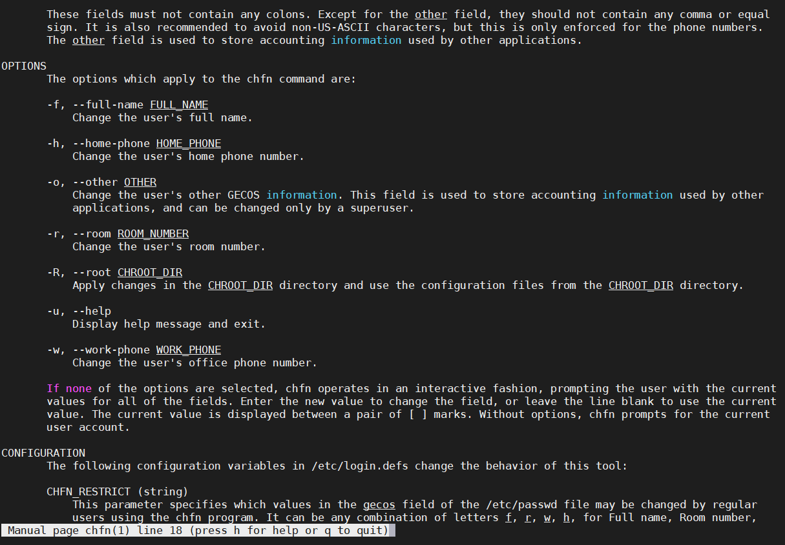

## Task5.1

## Part1

## 1) Log in to the system as root.

|  |
|:--:|
| <b> Img. 1.1 - sudo su </b> |

|  |
|:--:|
| <b> Img. 1.2 - su root </b> |

## 2) Use the passwd command to change the password. Examine the basic parameters of the command. What system file does it change *?

#### Change password for vagrant user

|  |
|:--:|
| <b> Img. 2.1 - passwd vagrant </b> |

#### Tell the vagrant user to change the password the next time he logs in

|  |
|:--:|
|  |
|:--:|
| <b> Img. 2.2 - passwd -e vagrant </b> |

#### Viewing the status of all users

|  |
|:--:|
| <b> Img. 2.3 - passwd -aS </b> |

#### Deleting the password of user1, which will make the specified account passwordless, but the next time you log in, you will need to change the password for the user

|  |
|:--:|
| <b> Img. 2.4 - passwd -d -e user1 </b> |

#### Block access to user2 and unblock

|  |
|:--:|
| <b> Img. 2.5 - user2 lock and unlock </b> |

#### Set the minimum number of days between password changes -n and the number of days to issue a warning before a password change is required - w

|  |
|:--:|
| <b> Img. 2.6 - passwd -n -w </b> |

#### The system file that changes this is/etc/passwd

## 3) Determine the users registered in the system, as well as what commands they execute. What additional information can be gleaned from the command execution?

#### Let's see the registered users of the system
|  |
|:--:|
| <b> Img. 3.1 -/etc/passwd </b> |

#### From this file we can find out the login; password hash; User ID; group id; information field GECOS; it is the home directory; shell.

#### To find out which users are currently active in the system, and what commands they execute, use the w utility:

|  |
|:--:|
| <b> Img. 3.2 - utility w </b> |

#### In addition, you can view the history of user logins. For this there is the last command, it displays information based on the/var/wtmp log:

|  |
|:--:|
| <b> Img. 3.3 - the last utility </b> |

## 4) Change personal information about yourself.

#### Using the finger utility we will check information about users, and using the chfn utility we will change information about it

|  |
|:--:|
| <b> Img. 4.1 - finger, chfn utilities </b> |

#### Also make sure the information in the/etc/passwd file also changes

> grep "vagrant"/etc/passwd

|  |
|:--:|
| <b> Img. 4.2 -/etc/passwd </b> |

#### You can change information using the usermod utility

|  |
|:--:|
| <b> Img. 4.3 - usermod utility </b> |

## 5) Become familiar with the Linux help system and the man and info commands. Get help on the previously discussed commands, define and describe any two keys for these commands. Give examples.

#### In addition to the main mission of the man command, viewing help about the required utility, command, or some system files, to begin with, you should look at the list of manual pages for a particular command. The example shows that besides the fact that passwd is a command, but there is also information about the system file passwd, how it is described and an example of how to access a specific page is given. Info is an alternative to man, but I prefer man.

|  |
|:--:|
| <b> Img. 5.1 - man </b> |

#### The passwd command has two switches -x (the maximum number of days for a password to exist, after the expiration date you need to change) and -n (the minimum number of days for a password to exist)

|  |
|:--:|
| <b> Img. 5.2 - info passwd </b> |

#### The chfn command has two switches -f (change username) and -r (change user room number)

|  |
|:--:|
| <b> Img. 5.3 - man chfn </b> |

#### The usermod command has two switches -a (include changes already installed in the changes) and -c (change the user field in the/etc/passwd file)

|  |
|:--:|
| <b> Img. 5.4 - man usermod </b> |

## 6) Explore the more and less commands using the help system. View the contents of files .bash * using commands.

#### .bash files *

|  |
|:--:|
| <b> Img. 6.1 - .bash * files </b> |

#### The more utility can be useful if you need to display file content that does not fit on the screen. The more utility allows you to view the contents of a file, divided into pages. After opening a file using this utility, use the space bar to move to the next page or the q key to exit the file viewing mode. The less utility is analogous to more.

|  |
|:--:|
| <b> Img. 6.2 - more .bashrc </b> |

> less -N -I .bash_history

|  |
|:--:|
| <b> Img. 6.3 - less .bash_history </b> |

## 7) * Describe in plans that you are working on laboratory work 1.

|  |
|:--:|
| <b> Img. 7.1 - finger plans </b> |

## 8) * List the contents of the home directory using the ls command, define its files and directories.

#### Let's display a list of directories and files, where at the beginning d means this is a directory, and where means this is a file

|  |
|:--:|
| <b> Img. 8.0 - ls -l </b> |

## Part2

## 1) Examine the tree command. Master the technique of applying a template, for example, display all files that contain a character c, or files that contain a specific sequence of characters. List subdirectories of the root directory up to and including the second nesting level.

#### Display the tree of the entire root directory (line by line)

|  |
|:--:|
| <b> Img. 1.1 - tree </b> |

#### Using the template

|  |
|:--:|
| <b> Img. 1.2 - tree template </b> |

#### Output derav with nesting 2 (line by line)

|  |
|:--:|
| <b> Img. 1.2 - tree template </b> |

## 2) What command can be used to determine the type of file (for example, text or binary)? Give an example.

#### In order to determine the file type, it is enough to use the file utility

|  |
|:--:|
| <b> Img. 2.1 - file </b> |

|  |
|:--:|
| <b> Img. 2.2 - file </b> |

## 3) Master the skills of navigating the file system using relative and absolute paths. How can you go back to your home directory from anywhere in the filesystem?

#### Relative path

|  |
|:--:|
| <b> Img. 3.1 - cd </b> |

#### The absolute path

|  |
|:--:|
| <b> Img. 3.2 - cd </b> |

#### go back to your home directory from anywhere in the filesystem

|  |
|:--:|
| <b> Img. 3.3 - cd </b> |

## 4) Become familiar with the various options for the ls command. Give examples of listing directories using different keys. Explain the information displayed on the terminal using the -l and -a switches.

#### List the directories and files and recursively display the contents of the directories

|  |
|:--:|
| <b> Img. 8.1 - ls -R </b> |

#### List all (hidden) directories and files

|  |
|:--:|
| <b> Img. 8.2 - ls -al </b> |

#### On Img. 8.2 we see the display of the file type (directory, file, link and others); acces modes; # of links; owner; group; size; modification date and time; name

#### List all (hidden) directories and files and display inodes

|  |
|:--:|
| <b> Img. 8.3 - ls -ali </b> |

#### Display a list of directories and files with folder size in an easy-to-read format, as well as the total creation time

|  |
|:--:|
| <b> Img. 8.4 - ls -lh --full-time </b> |

#### List all (hidden) directories and files, sort them alphabetically and put the names of directories and files in quotes

|  |
|:--:|
| <b> Img. 8.5 - ls -alXQ </b> |

#### Display a list of all directories and files as a list

|  |
|:--:|
| <b> Img. 8.6 - ls -1 </b> |

## 5) Perform the following sequence of operations: - create a subdirectory in the home directory; - in this subdirectory create a file containing information about directories located in the root directory (using I/O redirection operations); - view the created file ; - copy the created file to your home directory using relative and absolute addressing. - delete the previously created subdirectory with the file requesting removal; - delete the file copied to the home directory.

|  |
|:--:|
| <b> Img. 5.1 - mkdir, rm, cp, ls, cat </b> |

## 6) Perform the following sequence of operations:

### - create a subdirectory testin the home directory;

|  |
|:--:|
| <b> Img. 6.1 - </b> |

### - copy the .bash_historyfile to this directory while changing its name to labwork2; - create a hard and soft link to the labwork2 file in the test subdirectory;

|  |
|:--:|
| <b> Img. 6.2 - </b> |

### - how to define soft and hard link, what do theseconcepts;

##### Soft links are most similar to regular shortcuts. They contain the address of the desired file on your file system. When you try to open such a link, the target file or folder opens. Its main difference from hard links is that when the target file is deleted, the link will remain, but it will point to nowhere, since the file actually no longer exists.

##### The hard link is implemented at a lower level in the filesystem. The file is located only in a specific location on the hard drive. But this location can be referenced by multiple links from the file system. Each of the links is a separate file, but they lead to one section of the hard drive. The file can be moved between directories, and all links will remain working, since they don't care about the name.

##### You can determine that the link is hard by the inode number, it will match the target file, and the symbolic link has an arrow indicating the file to which it refers

|  |
|:--:|
| <b> Img. 6.3 - </b> |

### - change the data by opening a symbolic link. What changes will happen and why

|  |
|:--:|
| <b> Img. 6.4 - </b> |

#### The information has changed everywhere, since the symbolic link to the target file, and the hard link is essentially the same file.

|  |
|:--:|
| <b> Img. 6.5 - </b> |

### - rename the hard link file to hard_lnk_labwork2;
### - rename the soft link file to symb_lnk_labwork2 file;

|  |
|:--:|
| <b> Img. 6.6 - </b> |

### - then delete the labwork2. What changes have occurred and why?

|  |
|:--:|
| <b> Img. 6.7 - </b> |

#### As seen with img. 6.7 the symbolic link turned red, which symbolizes that it is not working since we deleted the file to which it referred, and the hard link remained as it was, all the information that was saved in it, but if you delete it, then the data will be lost.

## 7) Using the locate utility, find all files that contain the squid and traceroute sequence.

#### This utility is similar to find, but before using it you need to index all the files, which takes time, but then everything can be found very easily and quickly

|  |
|:--:|
| <b> Img. 7.1 - locate </b> |

## 8) Determine which partitions are mounted in the system, as well as the types of these partitions.

#####/proc/mounts - list of mounted file systems.

|  |
|:--:|
| <b> Img. 8.1 </b> |

## 9) Count the number of lines containing a given sequence of characters in a given file.

#### 18 lines and 1032 characters
|  |
|:--:|
| <b> Img. 9.1 - wc </b> |

## 10) Using the find command, find all files in the/etc directory containing the host character sequence.

|  |
|:--:|
| <b> Img. 10.1 - find </b> |

## 11) List all objects in/etc that contain the ss character sequence. How can I duplicate a similar command using a bunch of grep?

|  |
|:--:|
| <b> Img. 11.1 - find </b> |

|  |
|:--:|
| <b> Img. 11.2 - grep </b> |

## 12) Organize a screen-by-screen print of the contents of the/etc directory.

|  |
|:--:|
| <b> Img. 12.1 </b> |

## 13) What are the types of devices and how to determine the type of device? Give examples.

### Character Device

#### These devices transfer data, but one a character at a time (/ dev/null) these devices aren't really physically connected to the machine.

### Block Device

#### These devices transfer data (harddrives, filesystems, etc.)

### Pipe Device

#### Named pipes allow two or more processes to communicate with each other, these are similar to character devices, but instead of having output sent to a device, it's sent to another process.

### Socket Device

#### Socket devices facilitate communication between processes, similar to pipe devices but they can communicate with many processes at once.

|  |
|:--:|
| <b> Img. 13.1 </b> |

## 14) How to determine the type of file in the system, what types of files are there?

#### The type of file can be determined using the ls, file utilities. The following file types exist:

##### 1) Regular files ('-')
##### 2) Directory files ('d')
##### 3) Special files (Actually, this one has 5 types in it.)
##### 3.1) Block file ('b')
##### 3.2) Character device file ('c')
##### 3.3) Named pipe file or just a pipe file ('p')
##### 3.4) Symbolic link file ('l')
##### 3.5) Socket file ('s')

|  |
|:--:|
| <b> Img. 14.1 </b> |

## 15) * List the first 5 directory files that were recently accessed in the/etc directory

|  |
|:--:|
| <b> Img. 15.1 </b> |