## Task5.2

Task  assignment.

## 1) Analyze the structure of the /etc/passwd and /etc/group file, what fields are present in it, what users exist on the system? Specify several pseudo-users, how to define them?

### The file /etc/passwd contains the folllowing  fields:

* username
* password
* unique identifier of the user
* unique identifier of the group
* extended user description
* user's home directory
* user's command interpreter 

| 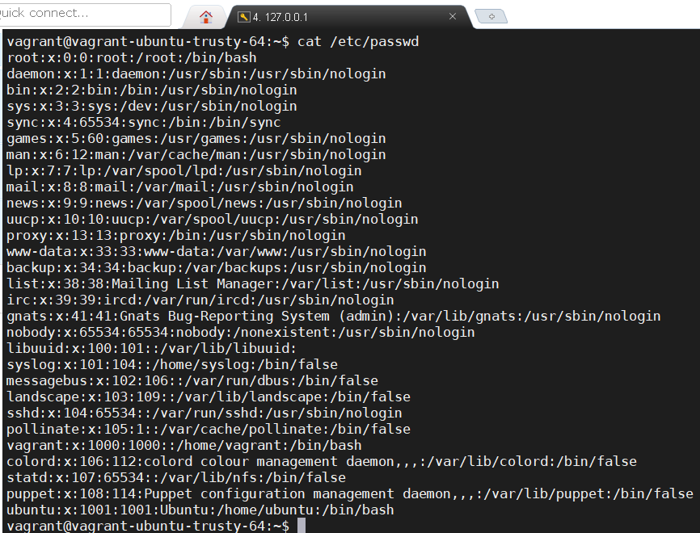 |
|:--:|
| <b> Img. 1.1 - /etc/passwd </b> |

### The file /etc/group contains the folllowing  fields:

* name of group
* password
* unique identifier of the group
* list of users belonging to this group (comma separated)

| 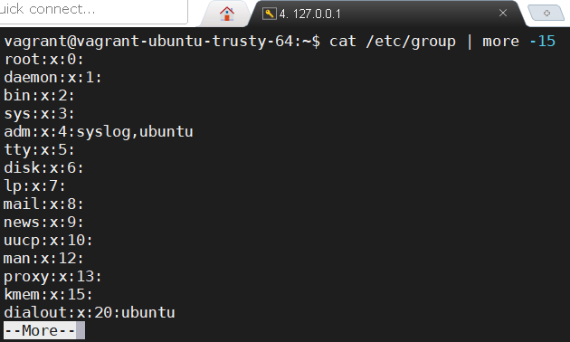 |
|:--:|
| <b> Img. 1.2 - /etc/group </b> |

### There are three types of users on Linux:

* root - superuser, has the right to perform all operations without exception.
* System users (psevdo-users) are system processes that have accounts to manage privileges and access rights to files and directories.
* Regular users - user accounts authorized to manage the system.

#### Each user has, in addition to his name, a numerical user ID (UID) (User ID). The root user has an ID of 0. Psevdo-users have IDs from 1 to 1000. Normal users have a UID of 1000.

### The most Psevdo-users used are:
* daemon - Used by system service processes
* bin - Gives ownership of executables command
* adm - Owns registration files
* nobody - Used by many services
* sshd – Used by the secure shell server

#### As mentioned above, id for pseudo-users in the range from 1 to 1000 and in this way they can be determined

## 2) What are the uid ranges? What is UID? How to define it?

### UID is a unique identifier of the user within the system.

#### UID 0 is reserved for root, the unrestricted user account. The lower UIDs (typically up to 999) are used for system accounts, and the higher UIDs (from 1000 on by default), are reserved for people that need to connect directory to the server.

#### The UID can be determined as described above using the / etc / passwd file using for example grep or using the command id. You can also use the utility getent and for the current user you can simply use echo $UID:

| 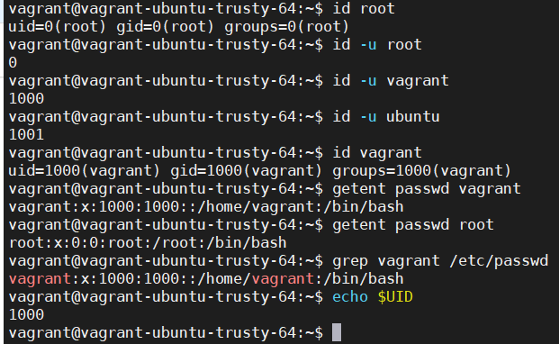 |
|:--:|
| <b> Img. 2.1 - id, grep, getent, $UID</b> |

#### Also we can combine utility grep and cut:

| 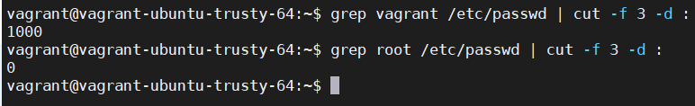 |
|:--:|
| <b> Img. 2.2 - grep and cut</b> |

## 3) What is GID? How to define it?

### GID is a unique identifier of the group within the system to witch the user belongs. On Linux, each user is a member of at least one group. This group is referred to as the primary group, and this group plays a central role in permissions management. 

#### The GID can be determined as described above using the /etc/group file using for example grep or using the command id. You can also use the utility getent and for the current user you can simply use echo $GID and also we can combine utility grep and cut:

| 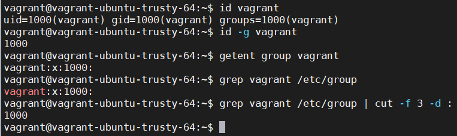 |
|:--:|
| <b> Img. 3.1 -  </b> |

## 4) How to determine belonging of user to the specific group? 

| 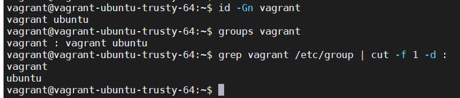 |
|:--:|
| <b> Img. 4.1 - id, group, grep and cut </b> |

## 5) What are the commands for adding a user to the system? What are the basic parameters required to create a user?

#### To add a user to the system you can use the command useradd (the user's home directory is automatically created) or adduser (the user's home directory is not automatically created)

| 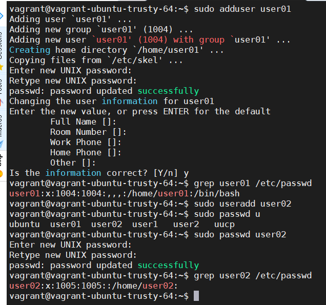 |
|:--:|
| <b> Img. 5.1 -  useradd, adduser</b> |

#### to create a user just give it a name, password and specify the group  and UID will be set automatically

#### example creating a user by setting a group, a password using passphrase encryption (devops) and creating a home directory

| 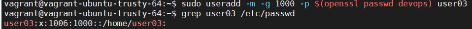 |
|:--:|
| <b> Img. 5.2</b> |

## 6) How do I change the name (account name) of an existing user?

| 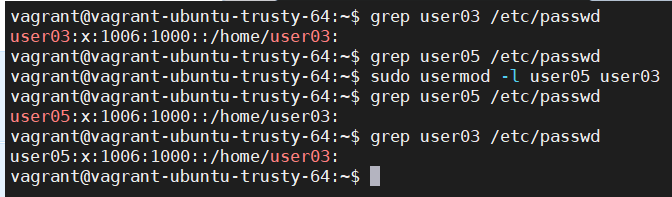 |
|:--:|
| <b> Img. 6.1 -  usermod -l</b> |

#### for beauty, we will also change the home directory of the user

| 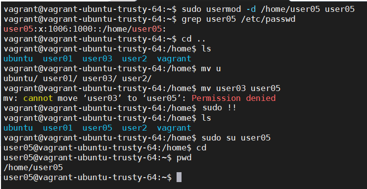 |
|:--:|
| <b> Img. 6.1 -  usermod -d</b> |

## 7) What is skell_dir? What is its structure?

#### skel_dir contains files which have to be copied to the new user's home directory.

| 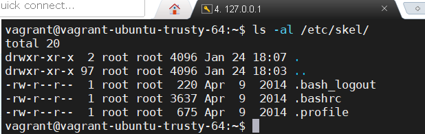 |
|:--:|
| <b> Img. 7.1 - Structure /etc/skel </b> |

## 8) How to remove a user from the system (including his mailbox)?

| 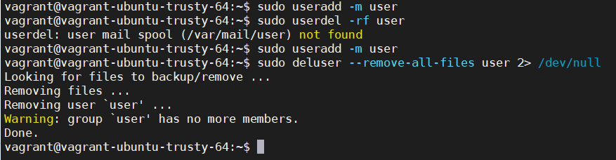 |
|:--:|
| <b> Img. 8.1 - userdel, deluser</b> |

## 9) What commands and keys should be used to lock and unlock a user account?

#### Run the passwd command with the -l switch to lock the given user account (passwd -u switch to unlock).
#### passwd -S user - check user's status:
* L - locked (or no password)
* P - unlocked (or password set)

| 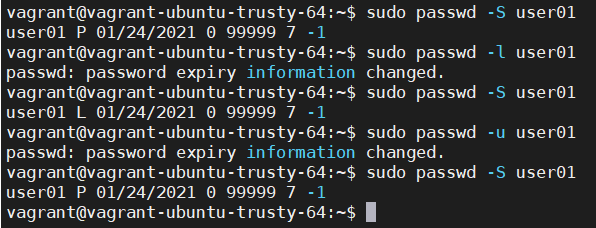 |
|:--:|
| <b> Img. 9.1 -  passwd</b> |

#### Run the usermod command with the -L switch to lock the given user account (usermod -U switch to unlock).

| 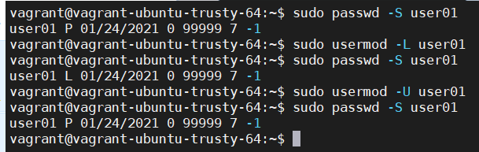 |
|:--:|
| <b> Img. 9.1 -  passwd</b> |

## 10) How to remove a user's password and provide him with a password-free login for subsequent password change?

| 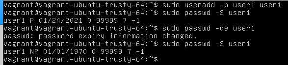 |
|:--:|
| 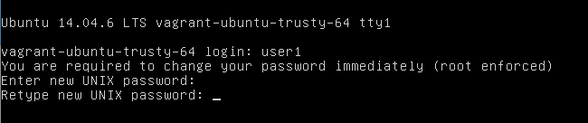 |
| 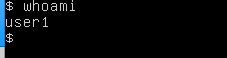 |
| <b> Img. 10.1 - passwd -de </b> |

## 11) Display the extended format of information about the directory, tell about the information columns displayed on the terminal.

#### First comes the file type (file, directory, pipe, socket, link, door, device file), then the first three records are the owner's rights, the second three records are the group's rights, the last three are the file's rights for everyone else. If you label each right with the appropriate letter and all rights are granted to everyone, you will receive the following entry: drwxrwxrwx. Next owner, group, size of file, modification date and time, name of file

| 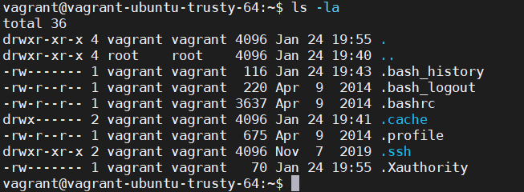 |
|:--:|
| <b> Img. 11.1 - ls -al </b> |

#### There is a SUID bit. This allows the file to be run as owner as in the ping example. This can come in handy when you need rights to run a Skirt, for example root, but we need everyone to be able to launch it.

| 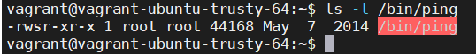 |
|:--:|
| <b> Img. 11.2 - ls -l /bin/ping </b> |

##### example of setting the SUID bit

| 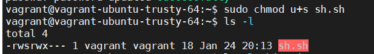 |
|:--:|
| <b> Img. 11.3 - SUID</b> |

#### There is also a SGID bit. The essence is the same as the previous one but for the group
##### example of setting the SGID bit

| 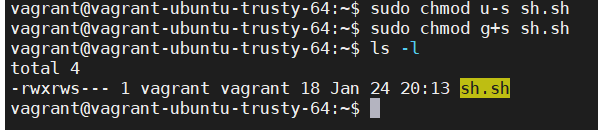 |
|:--:|
| <b> Img. 11.4 - SGID</b> |

## 12) What access rights exist and for whom (i. e., describe the main roles)? Briefly describe the acronym for access rights.

#### As mentioned above, there are three user groups in Linux: user, group, and others. For each group, set rwx (read, write and execute). Also for users there is SUID and for  groups is SGID. 

## 13) What is the sequence of defining the relationship between the file and the user?

#### First, access is defined for the user (owner), then access to the main group, of which the owner is a member (group), and then for others.

## 14) What commands are used to change the owner of a file (directory), as well as the mode of access to the file? Give examples, demonstrate on the terminal.

| 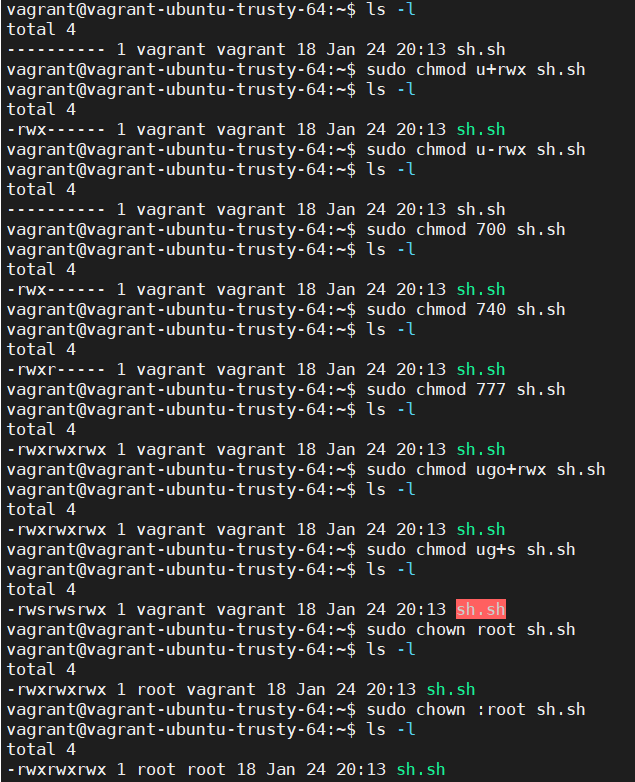 |
|:--:|
| <b> Img. 14.1 -chmod, chown  </b> |

## 15) What is an example of octal representation of access rights? Describe the umask command.

#### The umask utility allows you to view and set the file mode mask, which determines the bit permissions for newly created files or directories. It is used by the mkdir, touch and others commands, which create new files and directories.
#### If, for example, umask 002 and we create a directory, then to expand the rights to the directory you need 777-002 = 775, and for the file 666-002 = 664.

| 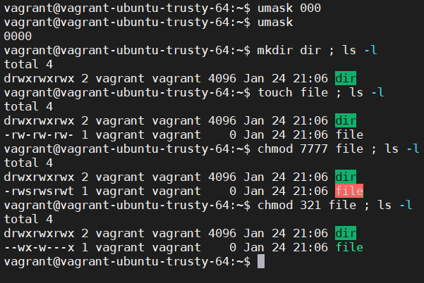 |
|:--:|
| <b> Img. 15.1 - umask </b> |

## 16) Give definitions of sticky bits and mechanism of identifier substitution. Give an example of files and directories with these attributes.

#### An attached bit is a bit that is set on others to protect a directory from someone else deleting the contents of the directory. To set the sticky bit, you just need to write examples of the following commands in the image:

| 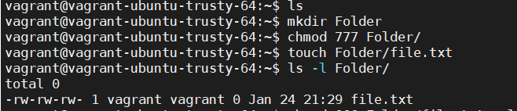 |
|:--:|
| 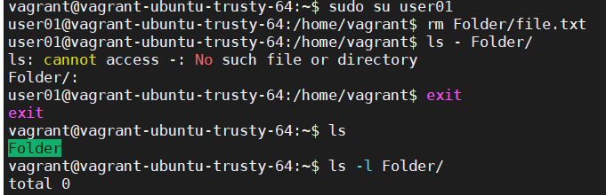 |
| 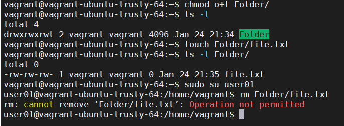 |
| <b> Img. 16.1 - sticky bit </b> |

## 17) What file attributes should be present in the command script?

| 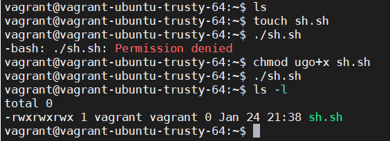 |
|:--:|
| <b> Img. 17.1 - chmod ugo+x  </b> |
