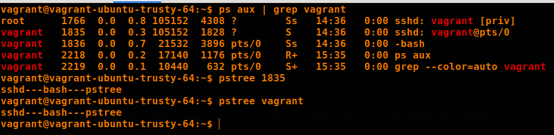
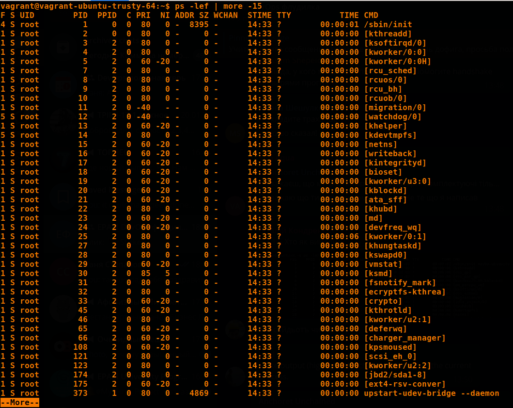
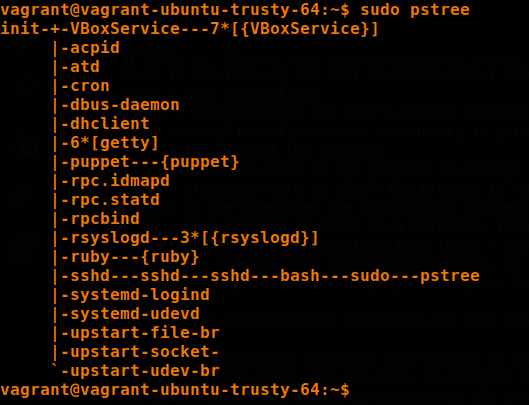
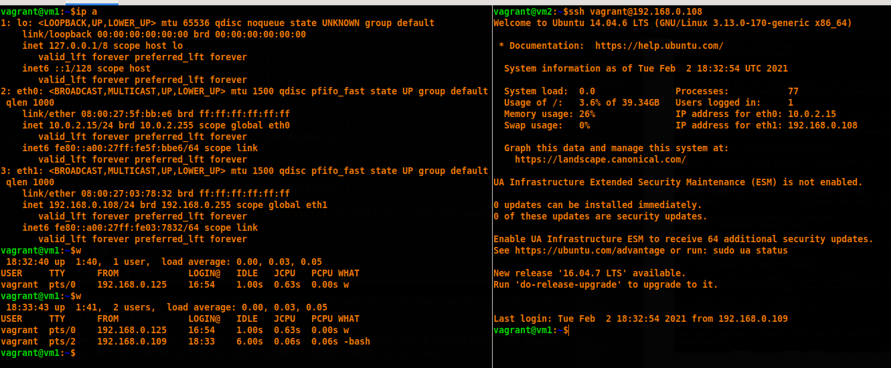

## Task5.3

### Part1

## 1. How many states could has a process in Linux?

#### Linux has five process states:

- Running (R) - The process is active and usingCPU time or in the queue of runnable processes waiting for an event to coplete
- Sleeping (S) - The process is waiting an event to complete
- Stopped (T) - The process has been stopped
- Zombie (Z) - The process has been stopped but could not be removed by its parent.
- Uninterruptable sleep (D) - The process is in a sleep state that cannot be stopped. A process is waiting for I/O (Usually)

|                |
| :-----------------------------------------: |
| <b> Img. 1.1 - The states of processes </b> |

## 2. Examine the pstree command. Make output (highlight) the chain (ancestors) of the current process.

#### pstree shows running processes in a tree view. The tree is rooted from either pid or init if pid is not specified. If a username is specified, then the tree forms the root of the processes owned by the specified user.

|            |
| :---------------------------------------: |
| <b> Img. 2.1 - pstree, pstree vagrant</b> |

#### -p - Show PID

#### -g - Show PGIDs

|  |
| :-----------------------------: |
| <b> Img. 2.2 - pstree -pg.</b>  |

#### -n - Sort processes with the same ancestor by PID

|  |
| :-----------------------------: |
| <b> Img. 2.3 - pstree -pgn.</b> |

#### -a - show command attributes of process

|  |
| :-----------------------------: |
|  <b> Img. 2.4 - pstree -a.</b>  |

|                         |
| :--------------------------------------------------: |
| <b> Img. 2.5 - the chain of the current process </b> |

#### We can display the tree chain by the PID of the process and also by the name:

|  |
| :---------------------------: |
|       <b> Img. 2.6</b>        |

## 3. What is a proc file system?

#### Proc is a certain folder that does not exist on the disk, all the information contained in this folder is generated on the fly by the kernel of the system, so if you try to find out the size of the data, it turns out that their size is zero and also each file will have the current creation date.

|  |
| :---------------------------: |
|       <b> Img. 3.1</b>        |

#### Most of the files are read-only, but there are writable files like /proc/sys with which we can set various kernel parameters.

- debug - contains debug information, it will be useful to you if you are a kernel developer
- dev - parameters of various devices connected to the system
- fs - all information about the filesystem
- kernel - allows you to directly configure the kernel
- net - configuring various network parameters
- vm - interact with the vm subsystem

|  |
| :---------------------------: |
|       <b> Img. 3.2</b>        |

## 4. Print information about the processor (its type, supported technologies, etc.).

|     |
| :------------------------------: |
| <b> Img. 4.1 - /proc/cpuinfo</b> |

|  |
| :---------------------------: |
|   <b> Img. 4.2 - lscpu</b>    |

## 5. Use the ps command to get information about the process. The information should be as follows: the owner of the process, the arguments with which the process was launched for execution, the group owner of this process, etc.

|  |
| :---------------------------: |
|       <b> Img. 5.1</b>        |

#### the meaning of the main columns in the utility output:

- UID is the name of the user on whose behalf the process is running;
- PID - user identifier;
- PPID - identifier of the user's parent process;
- C - consumption of processor resources, in percent;
- SZ is the size of the process;
- RSS is the real size of the process in memory;
- PSR - processor core on which the process is running;
- STIME is the time when the process was started;
- TTY - if a process is bound to a terminal, then its number will be displayed here;
- TIME - total process execution time (user + system);
- CMD - the command that started the process, if the program cannot read the arguments of the process, it will be displayed in square brackets.

## 6. How to define kernel processes and user processes?

#### The linux kernel processes are started by the kernel itself, while the parent process that allegedly spawned them is assigned the kthread process, with PID = 2. Thus, the kernel processes should be considered the process itself with PID = 2, as well as processes with PPID (i.e. pid parent) is 2.

|        |
| :---------------------------------: |
|      |
| <b> Img. 6.1 - kernel processes</b> |

|      |
| :-------------------------------: |
|    |
| <b> Img. 6.2 - user processes</b> |

## 7. Print the list of processes to the terminal. Briefly describe the statuses of the processes. What condition are they in, or can they be arriving in?

|  |
| :---------------------------: |
|  |
|       <b> Img. 7.1</b>        |

#### As you can see in Figure 7.1, most of the processes are sleeping(S), some are running(R).

#### They can also be in such states as:

- T - stopped;
- Z - zombie;
- X - dead;
- D - uninterrupatbly sleep.

## 8. Display only the processes of a specific user.

|      |
| :-------------------------------: |
| <b> Img. 8.1 - top -u vagrant</b> |

|     |
| :------------------------------: |
| <b> Img. 8.2 - ps -u vagrant</b> |

|  |
| :---------------------------: |
|   <b> Img. 8.3 - ps -x</b>    |

## 9. What utilities can be used to analyze existing running tasks (by analyzing the help for the ps command)?

- top command - display and update sorted information about Linux processes;
- atop command - system and process monitor for Linux;
- htop command - interactive process viewer in Linux (worse than top);
- pgrep command - look up or signal processes based on name and other attributed;
- pstree command - display a tree of processes.

## 10. What information does top command display?

|  |
| :----------------------------: |
|    <b> Img. 10.1 - top</b>     |

- process number (PID)
- the name of the user who launched it (USER).
- how the process has priority at the moment (PR)
- the priority assigned to the process by the NICE command (NI).
- VIRT - virtual memory used by the process
- RES - physical memory occupied by this process
- SHR - the total amount of memory that this process shares with others
- S - current status of the process: R - running; S - sleeping, Z - zombie
- %CPU - percentage of used CPU time
- %MEM is the percentage of RAM used by the process
- TIME + - the duration of the process from the start
- COMMAND - the name of the command (program) that initiated the process.

### Data before the table

#### The first line (top) gives us an overview of the system load. It states here:

- current time
- up - the duration of the system operation since the start
- user - current number of system users
- load average - average system load one minute ago, five and 15, respectively.

#### Next comes information about the state of the processor (% Cpu), RAM (Mem), SWAP

## 11. Display the processes of the specific user using the top command.

|      |
| :--------------------------------: |
| <b> Img. 11.1 - top -u vagrant</b> |

## 12. What interactive commands can be used to control the top command? Give a couple of examples.

- [i] Tasks that have not used any CPU since the last update will not be displayed
- [d] Change data refresh time
- [1] Display all statistics for all cores.
- [c] The absolute path of the command module and its arguments.
- [h] Display help about the program.
- [k] Kill the process. The program asks you for a process code and a signal that will be sent to it.
- [M] Sort by the amount of used memory.
- [n] Change the number of displayed processes. You are prompted to enter a number.
- [P] Sort by CPU load.
- [r] Change the priority of the process.
- [u] Sort by username.
- [Z] Select highlight color.
- [z] Highlight running processes.
- [Space] Refresh the screen immediately.

|  |
| :----------------------------: |
|    <b> Img. 12.1 - [d] </b>    |

|  |
| :----------------------------: |
|    <b> Img. 12.1 - [u] </b>    |

## 13. Sort the contents of the processes window using various parameters (for example, the amount of processor time taken up, etc.)

|                                                                |
| :------------------------------------------------------------------------------------------: |
| <b> Img. 13.1 - [M] - sort by the amount of used memory and [u] - sort by username(root)</b> |

|                                                        |
| :----------------------------------------------------------------------------------: |
| <b> Img. 13.2 - [P] - sort by the amount of CPU and [u] - sort by username(root)</b> |

|                  |
| :--------------------------------------------: |
| <b> Img. 13.3 - [T] - sort by working time</b> |

|                                       |
| :-----------------------------------------------------------------: |
| <b> Img. 13.4 - [T] - sort by working time and [N] - sor by PID</b> |

## 14. Concept of priority, what commands are used to set priority?

#### Each process is assigned a process priority, which determines how much CPU or processor time is allocated to it for execution.

#### To assign priority to a process, use the nice command. Its value ranges from -20 (highest priority) to 19 (lowest priority). The default priority is 0. To change the priority of a running process, use the renice command.

|  |
| :----------------------------: |
|   <b> Img. 14.1 - renice</b>   |

|  |
| :----------------------------: |
|    <b> Img. 14.2 - nice</b>    |

## 15. Can I change the priority of a process using the top command? If so, how?

- [r] Change the priority of the process.

|                      |
| :------------------------------------------------: |
|                      |
|                      |
| <b> Img. 15.1 - [r] - change NI of the process</b> |

## 16. Examine the kill command. How to send with the kill command process control signal? Give an example of commonly used signals.

#### The entire list of signals and their value

|         |
| :-----------------------------------: |
| <b> Img. 16.1 - list signal names</b> |

|             |
| :---------------------------------------: |
| <b> Img. 16.2 - Signal classification</b> |

- Term - to terminate the process.
- Ign - to ignore the signal.
- Core - to terminate the process and dump core (see core(5)).
- Stop - to stop the process.
- Cont - to continue the process if it is currently stopped.

#### how can the signal be controlled

|                                |
| :----------------------------------------------------------: |
| <b> Img. 16.3 - kill -9 `<pid>` or kill -SIGKILL `<pid>`</b> |

##### It isn't recommended to use kill -9, since after all that was stored in the process will be destroyed

#### Examples of commonly used signals.

|                                          |
| :--------------------------------------------------------------------: |
| <b> Img. 16.4 - kill -1 - Reload config files or restart utilities</b> |

|                             |
| :-------------------------------------------------------: |
| <b> Img. 16.5 - kill -15 or kill - Termination signal</b> |

## 17. Commands jobs, fg, bg, nohup. What are they for? Use the sleep, yes command to demonstrate the process control mechanism with fg, bg.

- jobs - Display a list of current background jobs
- bg - To continue its execution in the background
- fg - Take the task out of the background
- nohup - run a command immune to hangups, with output to a non-tty

|                |
| :------------------------------------------: |
| <b> Img. 17.1 - Example_1 - fg, bg, jobs</b> |

|                |
| :------------------------------------------: |
| <b> Img. 17.2 - Example_2 - fg, bg, jobs</b> |

|                       |
| :-------------------------------------------------: |
| <b> Img. 17.3 - Example_3 - nohup, fg, bg, jobs</b> |

### Part2

## 1. Check the implementability of the most frequently used OPENSSH commands in the MS Windows operating system. (Description of the expected result of the commands + screenshots: command – result should be presented)

#### First example. Easy connection to instance via ssh in Powershell.

|                |
| :------------------------------------------: |
| <b> Img. 1.1 - ssh vagrant@192.168.0.108</b> |

#### Second example. Connecting to an instance using ssh-keygen and scp.

|  |
| :----------------------------: |
| <b> Img. 1.2 - ssh-keygen</b>  |

|         |
| :-----------------------------------: |
| <b> Img. 1.3 - scp and connection</b> |

#### Third example. Connecting to an instance using mobaxterm.

|  |
| :----------------------------: |
|  <b> Img. 1.4 - mobaxterm</b>  |

|           |
| :-------------------------------------: |
| <b> Img. 1.5 - mobaxterm (terminal)</b> |

## 2. Implement basic SSH settings to increase the security of the client-server connection

#### We launch two copies on a vagrant with pre-set parameters, namely a static IP address and a tipi bridge network

|  |
| :----------------------------: |
|   <b> Img. 2.1 - vagrant</b>   |

|  |
| :----------------------------: |
|    <b> Img. 2.2 - ip a</b>     |

|                |
| :------------------------------------------: |
| <b> Img. 2.3 - ssh vagrant@192.168.0.109</b> |

|                |
| :------------------------------------------: |
| <b> Img. 2.4 - ssh-kegen and ssh-copy-id</b> |

## 3. List the options for choosing keys for encryption in SSH. Implement 3 of them.

- rsa
- dsa
- ecdsa
- ed25519

|  |
| :----------------------------: |
|  |
|     <b> Img. 3.1 - dsa</b>     |

|  |
| :----------------------------: |
|  |
|    <b> Img. 3.2 - ecdsa</b>    |

|  |
| :----------------------------: |
|  |
|   <b> Img. 3.2 - ed25519</b>   |

## 4. Implement port forwarding for the SSH client from the host machine to the guest Linux virtual machine behind NAT.

|                                                            |
| :--------------------------------------------------------------------------------------: |
|                                                            |
| <b> Img. 4.1 - Forwarding port 80 of the guest machine to port localhost: 12345 host</b> |

## 5\*. Intercept (capture) traffic (tcpdump, wireshark) while authorizing the remote client on the server using ssh, telnet, rlogin. Analyze the result.

### tcpdump

#### Each line includes:

1. Unix timestamp (14:08:01.919775)
2. protocol (IP)
3. source host name or IP address and port number (192.168.0.125.38702)
4. destination hostname or IP address and port number (192.168.0.109.22)
5. TCP Flags (Flags [F.]). Indicate the state of a connection and may contain more than one value:

- o S - SYN. The first step in establishing a connection
- F - FIN. Terminating the connection
- ACK. Confirmation packet received successfully
- P - PUSH. Instructs the receiver to process packets instead of buffering them
  = R - RST. Connection lost

6. Sequence number of data in the packet. (seq 1)
7. Confirmation number. (ack 2)
8. Window size (win 453). The number of bytes available in the receive buffer. Next are TCP options
9. Data payload length. (length 0)

#### ssh

|     |
| :-------------------------------: |
|     |
| <b> Img. 5.1 - ssh connection</b> |

When connecting ssh, we see that initially there is a request from 192.168.0.108:33397(VM1) to establish a connection (S flag) from 192.168.0.109:22(VM2). VM2 asks for confirmation and VM1 replies that with confirmation. VM1 tells VM2 to process packets instead of (P flag). VM2 confirms and asks VM1 to do the same to which VM1 responds in kind. And then they go through this procedure for a few more races, after which the connection is established and we enter the password for VM2, then there are packets for processing information (flags P) and since we managed to log into VM2, information is being exchanged.

#### telnet

|        |
| :----------------------------------: |
|        |
| <b> Img. 5.2 - telnet connection</b> |

When connecting via telnet in the first case, we see that initially there is a request from 192.168.0.108:33884(VM1) to establish a connection (flag S) from 192.168.0.109:80(VM2). VM2 asks for confirmation and VM1 responds with confirmation. VM1 tells VM2 to process packets instead of (P flag), namely GET / HTTP / 1.1. VM2 confirms. Then VM1 asks again to process packets (Host: 127.0.0.1). VM2 confirms. After that VM2 sends packets to VM1 (HTTP / 1.1 200 ok) and we can see the html page render on VM1 with 200 ok success code. After that VM1 acknowledges the received packets.

In the second case, everything is the same, but since the requested page does not exist, VM2 responded with an error 404 (not found) and on the VM1 side, the standard shtml code was displayed with this error.

#### rlogin

|        |
| :----------------------------------: |
|        |
| <b> Img. 5.3 - rlogin connection</b> |

Similar to ssh connection.
