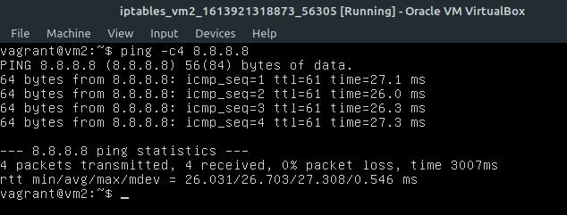

## Task6.1

## 1. Create virtual machines connection according to figure:

|       |
| :--------------------------------: |
| <b> Img. 1.1 - VMs connection </b> |

host ip: 192.168.0.150

## 2. VM2 has one interface (internal), VM1 has 2 interfaces (NAT and internal). Configure all networkinterfaces in order to make VM2 has an access to the Internet (iptables, forward, masquerade).

|  |
| :-----------------------------: |
| <b> Img. 2.1 - Vagrantfile </b> |

Image 2.1 shows that two ubuntu/xenial64 servers are going up. VM1 has two NAT adapters with port forwarding from 2233 to 22 over tcp and an intnet adapter, and VM2 has one intnet adapter.

|   |
| :----------------------------: |
| <b> Img. 2.2 - interfaces </b> |

|                            |
| :-------------------------------------------------------: |
| <b> Img. 2.3 - file /etc/network/interfaces.d/\*.cfg </b> |

Image 2.3 shows the interface settings

|                  |
| :---------------------------------------------: |
| <b> Img. 2.4 - file /etc/sysctl.conf (VM1) </b> |

|                                       |
| :----------------------------------------------------------------: |
| <b> Img. 2.5 - joined VM1 via console and configured iptables </b> |

## 3. Check the route from VM2 to Host.

|                       |
| :------------------------------------------------: |
| <b> Img. 3.1 - traceroute host(192.168.0.150) </b> |

Image 3.1 shows that you need to go through 4 stages to the host machine: 1) VM1 (essentially a router) 2) 10.0.2.2 (virtualbox interface ip) 3) something not yet known 4) host

## 4. Check the access to the Internet, (just ping, for example, 8.8.8.8).

|     |
| :------------------------------: |
| <b> Img. 4.1 - ping 8.8.8.8 </b> |

## 5. Determine, which resource has an IP address 8.8.8.8.

To complete this point, we needed to set the DNS (For example 8.8.8.8) to our virtual magine in advance (as you can see in the image 2.3 on the right)

|         |
| :----------------------------------: |
| <b> Img. 5.1 - nslookup 8.8.8.8 </b> |

## 6. Determine, which IP address belongs to resource epam.com.

|            |
| :-------------------------------------: |
| <b> Img. 6.1 - dig epam.com +short </b> |

## 7. Determine the default gateway for your HOST and display routing table.

|                  |
| :-------------------------------------------: |
| <b> Img. 7.1 - netstat -r -n OR route -n </b> |

## 8.Trace the route to google.com.

|              |
| :---------------------------------------: |
| <b> Img. 8.1 - traceroute google.com </b> |

1. VM1 - 10.10.10.1
2. virtualbox - 10.0.2.2
3. router didn't answer (maybe - 192.168.0.1)
4. provider main gateway - 10.10.109.253
   and so on ...
