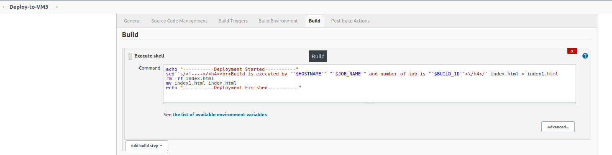

## Task8.1

### Jenkins Task

#### Create some templates using lection materials about Jenkins according your final task.

More detailed: choose the content part for your final task (simple web page, web application, etc) and programming language (java, js, python, etc), and type of delivery/deployment mechanism.

#### 1. Setting up the environment by setting up several servers on a vagrant

|  |
| :---------------------------: |
| <b> Img.1.1 - Vagrantfile</b> |

#### 2. Configuring Jenkins Server (Installing Jenkins and Plugins)

|          |
| :-----------------------------------: |
|          |
|          |
|          |
| <b> Img.2.1 - Configuring Jenkins</b> |

#### 3. We implement building and testing of the project from Git using the node VM4 host and, if the tests are successful, deploy it to the test VM2 server, if everything is fine, then deploy it to the production VM3 server

|                                                                                          |
| :-------------------------------------------------------------------------------------------------------------------: |
|                                <b> Img.2.2 - Create a host for VM4 (192.168.0.103)</b>                                |
|                                                                                          |
|                                         <b> Img.2.3 - Fill in the fields</b>                                          |
|                                                                                          |
|                                     <b> Img.2.4 - Create credentials for VM4</b>                                      |
|                                                                                        |
|             <b> Img.2.5 - We take the private key from the VM1 machine and copy the public one to VM4</b>             |
|                                                                                          |
|                    <b> Img.2.6 - Install java on VM4 in advance and create the Jenkins folder</b>                     |
|                                                                                          |
|                                            <b> Img.2.7 - node created</b>                                             |
|                                                                                          |
|                                      <b> Img.2.8 - node created and linked </b>                                       |
|                                                                                          |
| <b> Img.2.9 - We create a connection with VM2-test and VM-prod via Publish over ssh so that we can deploy to them</b> |
|                                                                                          |
|                     <b> Img.2.10 - copy the link to the repository for the job deploy-to-VM2</b>                      |
|                                                                                         |
|                                    <b> Img.2.11 - create ssh key-pair for git</b>                                     |
|                                                                                         |
|                               <b> Img.2.12 - create credentials for git on jenkins</b>                                |
|                                                                                         |
|                                 <b> Img.2.14 - Create job Deploy-to-VM2 (General)</b>                                 |
|                                                                                         |
|                          <b> Img.2.15 -Create job Deploy-to-VM2 (Source code management)</b>                          |
|                                                                                         |
|                             <b> Img.2.16 - FCreate job Deploy-to-VM2 (Build triggers)</b>                             |
|                                                                                         |
|                            <b> Img.2.17 - Create job Deploy-to-VM2 (Build environment)</b>                            |
|                                                                                         |
|                                  <b> Img.2.18 - Create job Deploy-to-VM2 (Build)</b>                                  |
|                                                                                         |
|                           <b> Img.2.19 - Create job Deploy-to-VM2 (Post-build actions)</b>                            |
|                                                                                          |
|            <b> Img.2.20 - before checking the task, set the rights of the specified user to /var/www </b>             |
|                                                                                         |
|                                     <b> Img.2.20 - start job (Deploy-to-VM2)</b>                                      |
|                                                                                         |
|                                       <b> Img.2.21 - CI/CD TEST ENVIRONMENT</b>                                       |

|                                                                      |
| :-----------------------------------------------------------------------------------------------: |
| <b> Img.3.1 - Creating a task for deployment to VM4 by copying it from the Deploy-to-VM2 job </b> |
|                                                                      |
|                              <b> Img.3.2 - Change Build triggers</b>                              |
|                                                                      |
|                                  <b> Img.3.3 - Change Build</b>                                   |
|                                                                      |
|                            <b> Img.3.4 - Change Post-build actions</b>                            |
|                                                                      |
|                            <b> Img.3.5 - start job (Deploy-to-VM2)</b>                            |
|                                                                      |
|             <b> Img.3.6 - Deploy-on-VM3 is started automatically after triggering</b>             |
|                                                                      |
|                         <b> Img.3.7 - old CV 192.168.0.101 (VM2-test)</b>                         |
|                                                                      |
|                         <b> Img.3.8 - old CV 192.168.0.102 (VM3-Prod)</b>                         |
|                                                                      |
|                      <b> Img.3.9 - Console output of a job Deploy-to-VM2</b>                      |
|                                                                     |
|                     <b> Img.3.10 - Console output of a job Deploy-to-VM3</b>                      |

#### Change index.html, main.css and commit changes

|                                                                            |
| :-----------------------------------------------------------------------------------------------------: |
|                                      <b> Img.4.1 - new commit</b>                                       |
|                                                                            |
| <b> Img.4.1 - Console output the Deploy-to-VM2 job manual to the console (running by an SCM change)</b> |
|                                                                            |
| <b> Img.4.1 - Console output the Deploy-to-VM3 job manual to the console (running by an SCM change)</b> |
|                                                                            |
|                            <b> Img.4.1 - new CV 192.168.0.101 (VM2-test)</b>                            |
|                                                                            |
|                            <b> Img.4.1 - new CV 192.168.0.101 (VM2-test)</b>                            |
