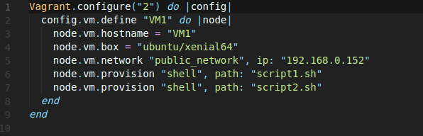
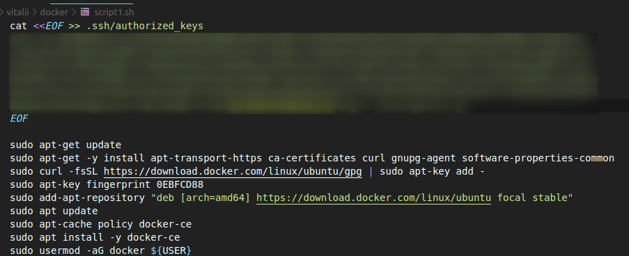
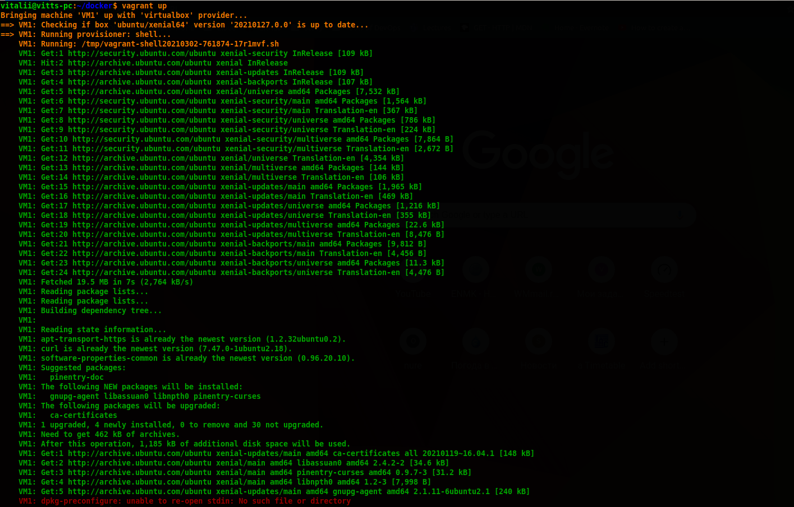
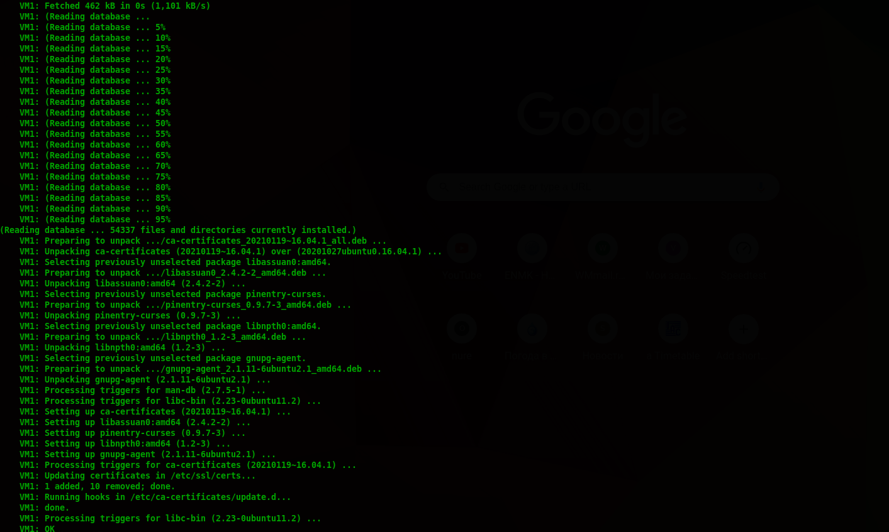
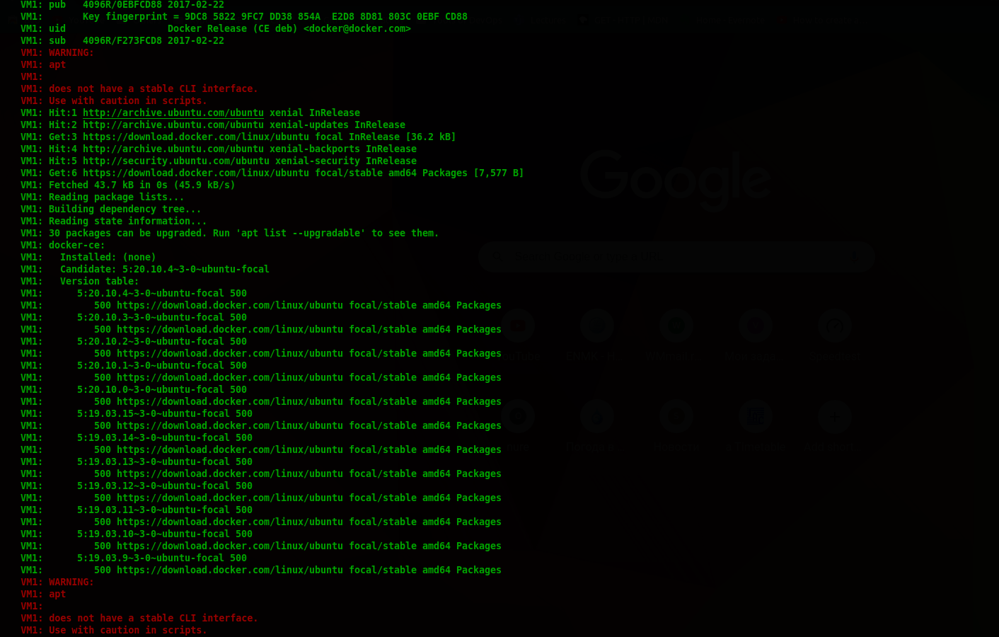
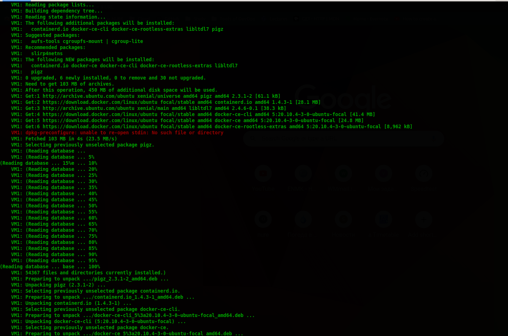
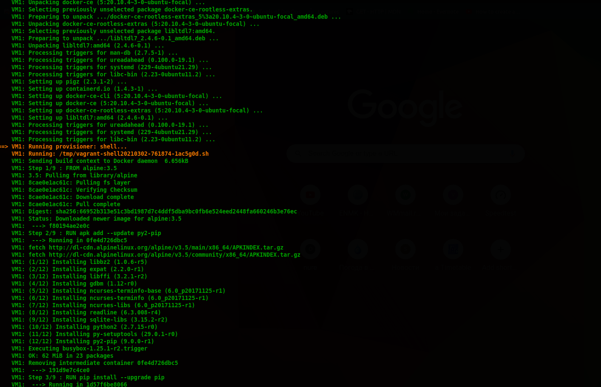
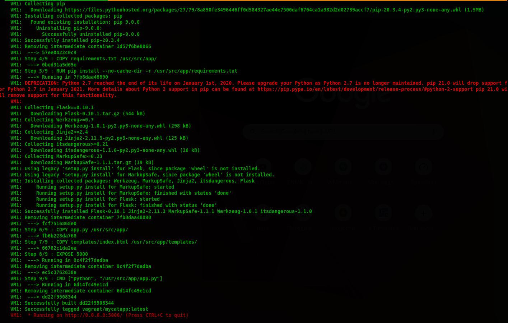
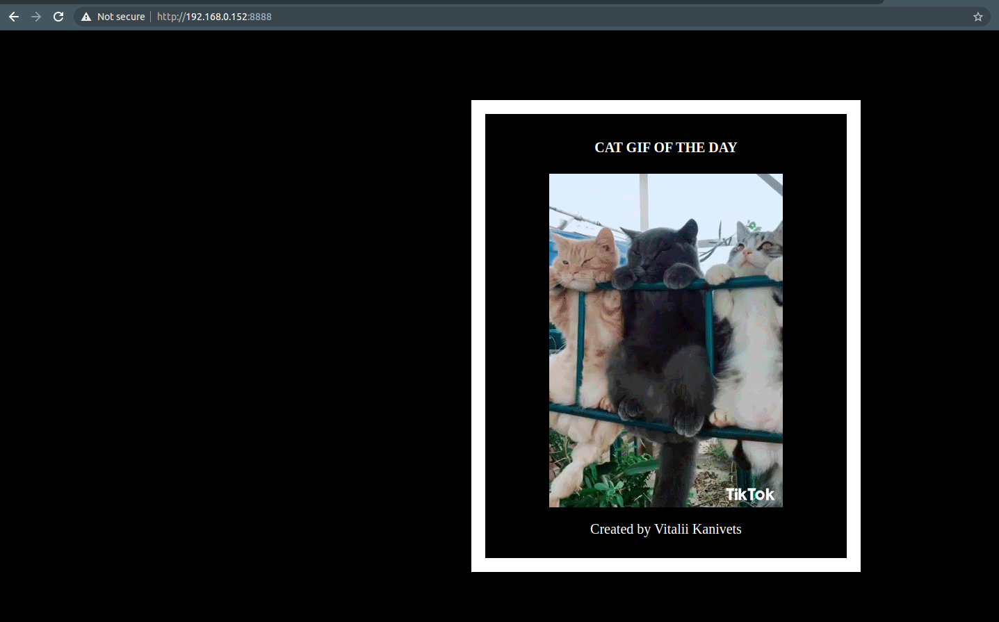

## Task11

## Docker task
#### 1. Webappswith Docker

Create a Vagrantfile and write two scripts for it. In script1, docker is installed on VM1, and in script2, a web application with a random cat pix is created and this application is launched on the docker image

|  |
| :---------------------------: |
| <b> Img.1.1 - Vagrantfile</b> |

|                  |
| :-------------------------------------------: |
| <b> Img.1.2 - script1 - installing docker</b> |

#### and script2 - creating flask-app in docker

```bash
mkdir -p flask-app/templates ; cd flask-app

cat <<EOF > app.py
from flask import Flask, render_template
import random

app = Flask(__name__)

# list of cat images
images = [
  "https://media.giphy.com/media/cfuL5gqFDreXxkWQ4o/giphy.gif",
  "https://media.giphy.com/media/oz0iZ8vYdgeTVMtFAe/giphy.gif",
  "https://media.giphy.com/media/8Ag4AORS8xPYHdeU6f/giphy.gif",
  "https://media.giphy.com/media/UotLuplZSzKRa/giphy.giff",
  "https://media.giphy.com/media/7ygVM8vWhlkEo/giphy.gif",
  "https://media.giphy.com/media/nl5wVNRJSWcO4/giphy.gif"
  ]

@app.route('/')
def index():
  url= random.choice(images)
  return render_template('index.html', url=url)

if __name__ == "__main__":
  app.run(host="0.0.0.0")
EOF

cat <<EOF > requirements.txt
Flask==0.10.1
EOF

cat <<EOF > templates/index.html
<html>
  <head><style type="text/css">
      body {
        background: black;
        color: white;
        }
      div.container {
        max-width: 500px;
        margin: 100px auto;
        border: 20px solid white;
        padding: 10px;
        text-align: center;
        }
      h4 {
        text-transform: uppercase;
        }
  </style></head>
  <body>
    <div class="container">
      <h4>Cat Gif of the day</h4>
      
      <p>Created by Vitalii Kanivets</p>
    </div>
  </body>
</html>
EOF

cat <<EOF > Dockerfile
FROM alpine:3.5

RUN apk add --update py2-pip
RUN pip install --upgrade pip

COPY requirements.txt /usr/src/app/
RUN pip install --no-cache-dir -r /usr/src/app/requirements.txt

COPY app.py /usr/src/app/
COPY templates/index.html /usr/src/app/templates/

EXPOSE 5000
CMD ["python", "/usr/src/app/app.py"]
EOF

sudo docker build -t vagrant/mycatapp .
sudo docker run -p 8888:5000 --name mycatapp vagrant/mycatapp
```

#### 2. vagrant up

|         |
| :----------------------------------: |
|         |
|         |
|         |
|         |
|         |
| <b> Img.1.3 - vagrant up</b> |

|         |
| :----------------------------------: |
| <b> Img.1.4 - 192.168.0.152:8888</b> |

